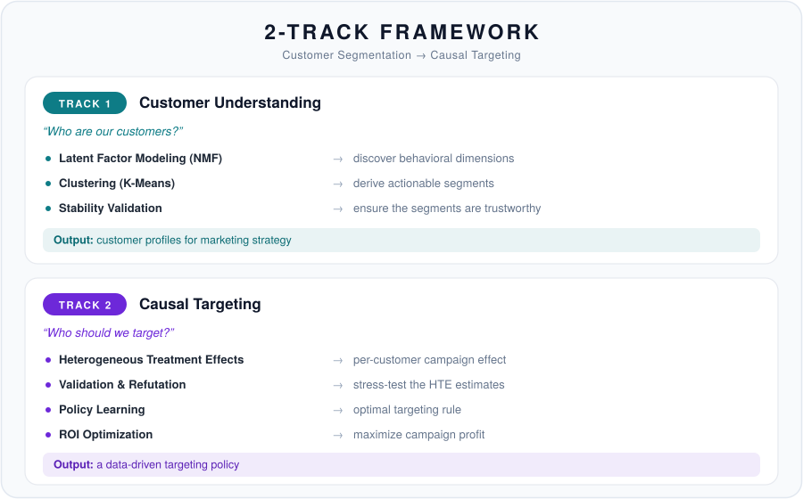
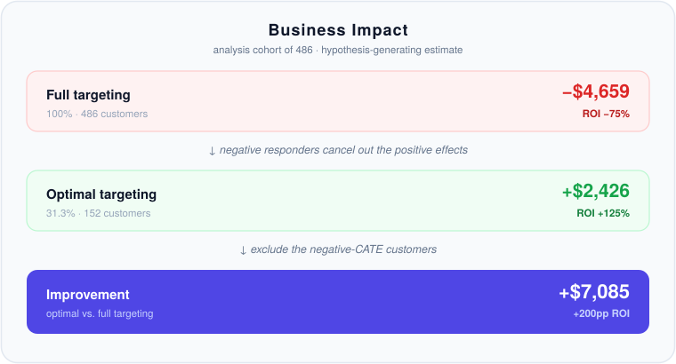
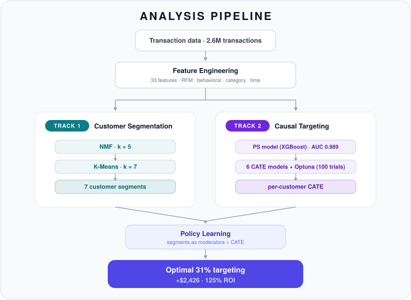

# Customer Segmentation & Causal Targeting — Dunnhumby

[🇰🇷 한국어](README.md) | **🇺🇸 English**

(this is the root README)


> **One-liner**: An end-to-end analysis of retail data spanning 2,500 households and 2.6M transactions — defining **7 customer segments**, then estimating **heterogeneous treatment effects (CATE)** and learning a **policy** that yields a **profit-maximizing 31% targeting rule**.

---

## ⏱️ TL;DR (30 seconds)

- **Problem** — Who should receive the coupon campaign (TypeA)? Blanket sends only inflate cost and end up losing money.
- **Approach** — A **2-Track Framework**. Track 1 answers *"who are our customers?"* (NMF + K-Means → 7 segments); Track 2 answers *"who should we target?"* (CATE estimation → policy learning).
- **Three headline findings**
  1. The highest-value segments (VIP Heavy, Bulk Shoppers) show a **negative CATE** — a signature of ceiling and cannibalization effects.
  2. Targeting only the **31.3% (152 / 486)** of the cohort that clears the **CATE > breakeven ($42.43)** bar maximizes profit.
  3. The observational data carry a **severe positivity violation** (PS AUC = 0.989, only 17% overlap), so the estimates are *hypothesis-generating* and **must be confirmed by an A/B test**.
- **Impact in one line** — Moving from full targeting (-$4,659) to optimal targeting (+$2,426) improves profit by **+$7,085 and ROI by +200pp** (on the analysis cohort; a hypothesis-generating estimate).

---

## 🎯 Key Results at a Glance

| Metric | Value | Note |
|--------|-------|------|
| Dataset size | 2,500 households · ~2.6M transactions · 102 weeks | Dunnhumby "The Complete Journey" |
| Number of segments | **7** (NMF k=5 → K-Means k=7) | 92.44% explained variance, bootstrap ARI 0.77±0.11 |
| Breakeven CATE | **$42.43** | cost $12.73 / margin 0.30 |
| Optimal targeting | **31.3% (152 / 486)** | profit **+$2,426**, ROI **125%** |
| Full targeting (100%) | 486 customers | profit -$4,659, ROI -75% |
| Current practice (62.1%) | 302 customers | profit -$3,402, ROI -88% |
| Improvement (optimal vs full) | **+$7,085** | +200pp ROI (hypothesis-generating) |
| Positivity diagnostic | PS AUC **0.989**, overlap **17%** | severe violation → hypothesis-generating reading |
| Primary CATE model | **CausalForestDML** | chosen for low variance + plausibility (see Track 2) |

**Seven customer segments — loyalty × deal-seeking positioning (Track 1)**


*Seven behavioral segments in loyalty (F2) × deal-seeking (F1) space. VIP Heavy = high-loyalty / low-deal (premium); Active Loyalists = high-loyalty / high-deal (budget-conscious).*

**ROI curve — optimal at 31.3%, 100% targeting loses money (Track 2)**


*ROI by targeting fraction. **Optimal at 31.3% (125% ROI)**; at 100% targeting the campaign turns into a **-75% ROI loss**.*

**CATE by segment — the negative effect on high-value segments is the counterintuitive core**


*CATE distribution by segment. The **negative effects for VIP Heavy (-$38) and Bulk Shoppers (-$40)** stand out — a signal to scale targeting back.*

### 🧭 Table of Contents

| Layer | Sections |
|-------|----------|
| 30 sec | [TL;DR](#️-tldr-30-seconds) · [Key Results at a Glance](#-key-results-at-a-glance) |
| 5 min | [Motivation & Framework](#motivation--framework) · [Key Insights](#key-insights-counterintuitive-findings) · [Results Summary](#results-summary) · [Limitations](#limitations--lessons-learned) |
| Reproduce | [Quick Start](#quick-start--reproducing-the-analysis) · [Repository Structure](#repository-structure) · [Technical Reports](#technical-reports) |
| 30 min | [Methodology](#methodology) · [Appendix](#appendix) |

---

## Motivation & Framework

This project brings two questions into a single pipeline: the classic segmentation question *"who are our customers?"* and the causal question *"how much does this campaign actually move each customer?"*



**Why do we need both tracks?**

| Dimension | Track 1 (Descriptive) | Track 2 (Causal) |
|-----------|----------------------|------------------|
| Core question | "Who is this customer?" | "Will the campaign work on this customer?" |
| Primary users | Marketing, CRM, strategy | Data Science, optimization |
| Interpretability | "the Premium Fresh Lover segment" | "this customer's CATE = +$34" |
| Organizational need | marketing built on customer understanding | causal thinking + a personalized-targeting execution loop |

---

## Key Insights: Counterintuitive Findings

### A negative treatment effect on high-value customers

> The N below is on the **Track 2 analysis cohort (486)**, which differs from the full Track 1 segment sizes (509, 299, …). CATE values are hypothesis-generating estimates.

| Segment | Customer value (full-sample avg revenue) | Mean CATE | N (cohort) | Directional signal |
|---------|-----------------------------------------|-----------|------------|--------------------|
| **VIP Heavy** | $9,716 (highest) | **-$38** | 59 | **reduce / exclude from TypeA** |
| **Bulk Shoppers** | $3,206 | **-$40** | 77 | **reduce / exclude from TypeA** |

**Why do high-value customers show a negative CATE?**

| Segment | Root-cause read |
|---------|-----------------|
| **VIP Heavy** | Already a high purchaser → **ceiling effect**; the coupon cannibalizes purchases they would have made anyway |
| **Bulk Shoppers** | A coupon-driven TypeA campaign **mismatches** their irregular, bulk-buying shopping rhythm |

**Business impact (on the 486-customer analysis cohort; hypothesis-generating):**



---

## Results Summary

### Track 1 Results: Latent Factor Modeling + Clustering

**Interpretation of the 5 latent factors (NMF k=5, 92.44% explained variance):**

| Factor | Name | Top features (loading) | Interpretation |
|--------|------|------------------------|----------------|
| **F1** | Grocery Deal Seeker | share_grocery(6.72), discount_usage_pct(5.13), private_label_ratio(3.41) | budget-minded, deal-seeking |
| **F2** | Loyal Regular | purchase_regularity(4.63), n_departments(2.61), n_products(1.53), frequency(1.04) | one-stop, high-engagement (Value) |
| **F3** | Big Basket | monetary_std(2.45), monetary_avg_basket(2.35), share_grocery(2.08) | irregular bulk buying (Value) |
| **F4** | Fresh Focused | share_fresh(2.26), n_departments(1.21) | fresh-food specialist (Need) |
| **F5** | Health & Beauty | share_health_beauty(2.03), recency(0.41) | drugstore-type shopper (Need) |


*Feature loadings for the 5 latent factors. F2 (Loyal) and F3 (Big Basket) capture the **Value dimension**; F4 (Fresh) and F5 (H&B) capture the **Need dimension**.*

**Clustering evaluation metrics (summary):**

| Metric | Value | Interpretation |
|--------|-------|----------------|
| Explained Variance | 92.44% | high factor coverage |
| Silhouette Score (k=7) | 0.219 | reasonable for behavioral data (not the global maximum — see appendix) |
| Calinski-Harabasz (k=7) | 732.0 | — |
| Davies-Bouldin Index (k=7) | **1.241** | **minimum across the k candidates (best separation)** |
| Bootstrap ARI | 0.77 ± 0.11 (n=100) | high segment stability |

> **An honest rationale for k**: Silhouette is actually highest at low k (k=3 = 0.271). We chose k=7 on the basis of the **minimum DBI (1.241)** plus **business interpretability/actionability** plus **high bootstrap stability (ARI 0.77)** — we do *not* claim "silhouette is best at k=7." The full grid is in [Appendix A](#appendix-a-clustering-k-selection-grid).

**The 7 customer segments (full sample of 2,500):**

| Seg | Name | Size | Avg revenue | Frequency (visits) | Recency (days) | Regularity | Dominant factor |
|-----|------|------|-------------|--------------------|----------------|-----------|-----------------|
| 0 | Active Loyalists | 509 (20.4%) | $3,878 | 171 | 6 | 0.78 | F2 (Loyal) |
| 1 | **VIP Heavy** | 299 (12.0%) | **$9,716** | 256 | 4 | 0.88 | F2 (Loyal) |
| 2 | Lapsed H&B | 193 (7.7%) | $872 | 37 | 75 | 0.25 | F5 (H&B) |
| 3 | Fresh Lovers | 339 (13.6%) | $1,233 | 48 | 36 | 0.34 | F4 (Fresh) |
| 4 | Light Grocery | 524 (21.0%) | $942 | 43 | 42 | 0.30 | F1 (Grocery-Deal) |
| 5 | **Bulk Shoppers** | 318 (12.7%) | $3,206 | 56 | 24 | 0.41 | F3 (Basket) |
| 6 | Regular + H&B | 318 (12.7%) | $3,393 | 152 | 12 | 0.70 | F2 (Loyal) |

> Light Grocery (Seg 4) loads on **F1 (Grocery-Deal)** — its grocery share (0.56) and discount usage (0.51) place it squarely on that factor, so we label its dominant factor F1.


*Positioning on Loyalty (F2) × Deal-Seeking (F1). VIP Heavy sits at **high loyalty + low deal-seeking** (premium loyalty); Active Loyalists at **high loyalty + high deal-seeking** (budget-minded loyalty).*

**Marketing strategy by segment (Track 1 basis):**

| Segment | Priority | Strategy | Key actions |
|---------|----------|----------|-------------|
| VIP Heavy | High | Retention | premium perks, churn prediction, exclusive access |
| Active Loyalists | High | Strengthen | private-label promotions, loyalty points, basket expansion |
| Regular + H&B | Medium | Upgrade | VIP-conversion program, cross-category incentives |
| Bulk Shoppers | Medium | Regularize | subscription offers, scheduled delivery, bundle deals |
| Fresh Lovers | Medium | Engage | fresh-food content, daily specials, recipes |
| Light Grocery | Low | Activate | habit-forming campaigns, gradual rewards |
| Lapsed H&B | Low | Win-back | re-engagement campaigns, H&B-focused offers |

> 💡 **Track 1 vs Track 2 strategy split**: Track 1 prescribes general strategy from customer traits; Track 2 prescribes TypeA-campaign targeting from CATE. For VIP Heavy the two diverge — Track 1 says "Retention," but Track 2 recommends **scaling TypeA targeting back**.

### Track 2 Results: CATE and Optimal Targeting

**ATE estimates (by method, n=2,430):**

| Method | ATE | 95% CI | Reliability |
|--------|-----|--------|-------------|
| Naive | +$471 | [$442, $501] | ❌ upward bias |
| IPW | +$151 | [-$10, $313] | ⚠️ unstable |
| AIPW | +$24 | [-$56, $104] | ✅ doubly robust |
| OLS | +$65 | [$29, $102] | — |
| DML | -$65 | [-$220, $90] | ⚠️ sign flip |
| **ATO (Overlap)** | **+$60** | [-$14, $134] | ✅ overlap-focused |

> The estimates scatter widely across methods, from -$65 to +$471 — a direct symptom of the positivity violation. We put more trust in the overlap-focused estimate (ATO +$60) and the doubly-robust estimate (AIPW +$24).

**CATE model performance (main run; test set):**

| Model | Mean CATE | Test Std | AUUC | % positive | Selected |
|-------|-----------|----------|------|------------|----------|
| **CausalForestDML** | **+$15** | **$52** | 271.6 | 78% | ✅ **Primary** |
| LinearDML | -$139 | $452 | **357.0** | 42% | ❌ highest AUUC but unstable |
| NonParamDML | +$1.1M (diverges) | very large | 304.4 | 64% | ❌ diverges |
| S-Learner | -$21 | $46 | 289.5 | 21% | ❌ implies 79% negative effects (implausible) |
| X-Learner | -$96 | $208 | 218.5 | 38% | ❌ high variance |
| T-Learner | -$200 | $397 | 212.0 | 43% | ❌ high variance |

> **Model selection (an honest reframe)**: CausalForestDML does **not** have the highest AUUC. In the main run the top AUUC belongs to **LinearDML (357.0)**, with CausalForestDML fourth (271.6). We still chose CausalForestDML as the primary model because it is the *only* model that simultaneously delivers **low variance (std $52 vs LinearDML's $452)** and a **plausible CATE distribution (mean ≈ +$10–15, 78% positive — consistent with the campaign's purpose)**. The higher-AUUC models are unusable: LinearDML (mean -$139, std $452) and NonParamDML (diverges) are out, and while S-Learner has comparable variance, it implies that **79% of customers experience a negative effect** — an implausible distribution. **Under a severe positivity violation, we prioritize stability and plausibility over raw AUUC.** (Supporting nuance: the BLP test is borderline at p=0.094 and X-Learner at p=0.005 — the heterogeneity signal is weak; details in the Track 2 report.) Across the full 486-customer cohort, CausalForestDML's mean CATE is a consistent **+$10**.


*AUUC comparison across CATE models. The uplift curve of CausalForestDML, selected on stability and plausibility. Targeting the **top 30% is projected to add $2,200+ in incremental profit**.*

#### Segment-level CATE and recommended actions

> N is on the **Track 2 analysis cohort (486)** and differs from the full Track 1 segment sizes. The "current/recommended targeting %" columns appear in no source CSV, so we present them only **directionally (expand / hold / reduce)**.

| Segment | N (cohort) | Mean CATE | Recommended action (directional) |
|---------|-----------|-----------|----------------------------------|
| Active Loyalists | 97 | **+$33** | Test & Learn (lean expand) |
| Regular + H&B | 62 | **+$34** | Test & Learn (lean expand) |
| Light Grocery | 91 | **+$30** | Test & Learn (expand) |
| Fresh Lovers | 73 | **+$27** | Test & Learn (expand) |
| Lapsed H&B | 27 | +$19 | Test & Learn |
| **VIP Heavy** | 59 | **-$38** | **reduce / exclude from TypeA** |
| **Bulk Shoppers** | 77 | **-$40** | **reduce / exclude from TypeA** |


*CATE distribution by segment. The **negative effects for VIP Heavy (-$38) and Bulk Shoppers (-$40)** are unmistakable.*

#### Policy comparison (486 cohort)

| Policy | Criterion | Target % (N) | Profit | ROI | Note |
|--------|-----------|--------------|--------|-----|------|
| **CATE > Breakeven** | point est. > $42.43 | **31.3% (152)** | **+$2,426** | **125%** | ✅ optimal |
| Top 20% CATE | percentile | 20.0% (97) | +$2,259 | **183%** | highest ROI under a budget cap |
| Conservative | lower CI > $42.43 | 0.6% (3) | +$188 | 493% | ultra-safe (pre-A/B) |
| Risk-Adjusted (30%) | risk-adjusted | 11.1% (54) | +$1,603 | 233% | variance penalty |
| PolicyTree (Tuned) | learned rules | 26.7% (130) | +$1,684 | 102% | interpretable |
| CATE > 0 | point est. > 0 | 64.6% (314) | +$1,447 | 36% | loose rule |
| Current practice | — | 62.1% (302) | **-$3,402** | **-88%** | ❌ loss |
| **Full targeting** | — | 100% (486) | **-$4,659** | **-75%** | ❌ **loss** |


*ROI by targeting fraction. **Optimal at 31.3% (125% ROI)**; at 100% targeting the campaign turns into a **-75% ROI loss**.*

---

## Limitations & Lessons Learned

| Limitation | Evidence | Mitigation |
|-----------|----------|------------|
| **Positivity violation** | PS AUC = 0.989, overlap 17% | PS trimming, ATO weighting, Manski bounds, partial identification |
| **Refutation test failed** | Placebo (Amount) 0.747 (>0.5 → FAIL), Subset Stability 0.561 (<0.7 → FAIL) | A/B-test validation design (n=5,748) |
| **Model disagreement** | CausalForest +$10 vs LinearDML -$139 | selected on stability/plausibility; sign disagreement acknowledged |
| **Single campaign type** | only TypeA analyzed | TypeB/C need separate analysis |

> **The refutation tests failed — and that is the expected result.** Placebo Treatment (Amount) = 0.747 (threshold < 0.5) and Subset Stability = 0.561 (threshold > 0.7) both fail to clear their thresholds (Placebo-Visits = 0.052 does pass). This is the **expected** signature under a positivity violation, and it reinforces that the results should be treated as *hypothesis-generating* rather than *confirmatory*. We do not hide or soften the result.

### Lessons

> "PS AUC = 0.989 exposes the fundamental limit of an observational study.
> The results should be read as **hypothesis-generating**,
> and **validated by an A/B test before deployment**."

### Future directions

1. **A/B-test validation**: confirm the hypotheses with n=5,748 (2,874/arm, 80% power, α=0.05, detectable effect ~$34).
2. **ε-greedy exploration**: assign treatment to every customer with at least probability ε → restore positivity.
3. **MLOps scale-up**: a CATE monitoring dashboard and a model-retraining pipeline.

---

## Quick Start / Reproducing the Analysis

```bash
# 1) Clone the repository
git clone <repo-url>
cd kr_segmentation_causal_targeting_dunnhumby

# 2) Install dependencies (Python 3.12 recommended)
pip install -r requirements.txt

# 3) Prepare the data (see 'Data Source & Attribution' below)
#    Place the original Dunnhumby "The Complete Journey" CSVs in data/dunnhumby/raw/
#    (the raw data is not redistributed in this repo for license reasons)

# 4) Run the notebooks in order (each step depends on the previous outputs)
#    00 → 01 → 02 (Track 1)  →  03a → 03b → 04 (Track 2)
jupyter lab notebook/
```

**Notebook execution order**

```
00_study_design → 01_feature_engineering → 02_customer_profiling      (Track 1)
                                         → 03a_hte_estimation
                                         → 03b_hte_validation
                                         → 04_optimal_policy           (Track 2)
```

**Where outputs land**

| Location | Contents |
|----------|----------|
| `results/figures/` | visualization PNGs (PS overlap, factor loadings, uplift, ROI curves, etc.) |
| `results/tables/` · `results/*.csv` | result tables (ATE/CATE, policy comparison, segment recommendations, breakeven scenarios, etc.) |
| `data/dunnhumby/processed/` | cleaned and derived data (features, NMF loadings, segment profiles) |

---

## Repository Structure

```
kr_segmentation_causal_targeting_dunnhumby/
├── notebook/                 # analysis notebooks (00→01→02→03a→03b→04) + eda/
├── src/                      # Python modules
│   ├── features.py           #   construct 33 customer features
│   ├── segments.py           #   NMF + K-Means segmentation
│   ├── cohorts.py            #   treatment/control cohort definition
│   ├── treatment_effects.py  #   ATE/CATE estimation, positivity diagnostics
│   ├── policy.py             #   policy learning, DR/IPW value
│   ├── business.py           #   ROI curves, breakeven, targeting priorities
│   ├── metrics.py            #   uplift metrics (AUUC, Qini)
│   ├── plots.py              #   visualization functions
│   ├── ray_utils.py          #   Ray-parallel CATE training, Optuna tuning
│   ├── preprocess.py         #   raw-transaction loading/preprocessing
│   └── utils.py              #   small helpers
├── docs/                     # technical reports + glossary + assumptions doc
├── data/dunnhumby/           # raw/ (original CSVs) · processed/ (cleaned data)
├── results/                  # figures/ (PNG) · tables/ (CSV)
└── requirements.txt
```

---

## Technical Reports

For detailed methodology, results, and business interpretation, see:

- **[Track 1 Report (EN)](docs/track1_report.en.md)** · [KR](docs/track1_report.md) — Customer Segmentation Analysis
  - NMF factor interpretation, segment profiles, per-segment marketing actions
- **[Track 2 Report (EN)](docs/track2_report.en.md)** · [KR](docs/track2_report.md) — Causal Targeting Analysis
  - positivity diagnostics, CATE estimation, policy comparison, A/B-test design
- **[Positivity Assumption](docs/positivity_assumption.md)** — positivity-violation diagnosis and mitigation in detail
- **[Glossary](docs/GLOSSARY.md)** — definitions of core terms (CATE, AUUC, ATO, Manski bounds, etc.)

---

## Notebooks

### Track 1: Customer Segmentation

| Notebook | Description |
|----------|-------------|
| [00_study_design.ipynb](notebook/00_study_design.ipynb) | study design and the 2-Track Framework |
| [01_feature_engineering.ipynb](notebook/01_feature_engineering.ipynb) | construct 33 customer features |
| [02_customer_profiling.ipynb](notebook/02_customer_profiling.ipynb) | NMF latent factors + K-Means segmentation |

### Track 2: Causal Targeting

| Notebook | Description |
|----------|-------------|
| [03a_hte_estimation.ipynb](notebook/03a_hte_estimation.ipynb) | ATE/CATE estimation across methods |
| [03b_hte_validation.ipynb](notebook/03b_hte_validation.ipynb) | validation, refutation tests, bounds |
| [04_optimal_policy.ipynb](notebook/04_optimal_policy.ipynb) | policy learning and ROI optimization |

### Source Modules (`src/`)

| Module | Description |
|--------|-------------|
| `features.py` | extract 33 customer features (RFM, behavioral, category, time) |
| `segments.py` | NMF latent factors + K-Means segmentation |
| `cohorts.py` | per-campaign treatment/control cohort construction |
| `treatment_effects.py` | ATE/CATE estimation, positivity diagnostics, Manski bounds |
| `policy.py` | policy learning (IPW/DR value estimation) |
| `metrics.py` | uplift metrics (AUUC, Qini) |
| `business.py` | ROI calculation, per-segment recommendations |
| `plots.py` | HTE/policy visualization functions |
| `ray_utils.py` | Ray-parallel CATE training, Optuna 100-trial tuning |
| `preprocess.py` | raw-transaction loading/preprocessing |

---

## Technical Stack

- **Data Processing**: pandas, numpy
- **Machine Learning**: scikit-learn, xgboost
- **Causal Inference**: econml, dowhy, statsmodels
- **Optimization**: Optuna (hyperparameter tuning), Ray (parallelization)
- **Visualization**: matplotlib, seaborn

---

## Data Source & Attribution

**Dunnhumby "The Complete Journey"**
- **2,500 households** and **~2.6M (2,595,732) transactions** over 102 weeks
- campaign data (TypeA/B/C), coupon redemptions
- demographic segments

This is the "The Complete Journey" dataset that dunnhumby released for research and education. **Per the license, the raw data is not redistributed in this repository**; you must download it yourself and place it in `data/dunnhumby/raw/`.

Dataset documentation and source: [data/dunnhumby/README.md](data/dunnhumby/README.md)

---

## Methodology

> A detailed section for readers who want the equations and decision rationale behind the 30-second and 5-minute summaries.

### Analysis Pipeline



**Temporal split**: pre-period weeks 1–31 (build covariates), campaign/outcome weeks 32–102.

### Track 1: Customer Segmentation

> **Why NMF + K-Means?**
> - **Interpretability**: the non-negativity constraint yields intuitive factors → easy to communicate with marketing stakeholders.
> - **Fast iteration**: parameter tuning and experiment cycles are quick → the segment definitions can be revised and improved continuously.
> - Customer segmentation lives or dies on collaboration with the marketing team, so **communicable interpretability** and a **fast experiment loop** matter more than a complex model.

**NMF (Non-negative Matrix Factorization)**

```
V ≈ W × H

- V: customer-feature matrix (n × m)
- W: customer-factor matrix (n × k)  → per-customer factor scores
- H: factor-feature matrix (k × m)   → feature weights of each factor
```

**K-Means Clustering**

```
min Σᵢ Σⱼ ||wᵢ - μⱼ||²

- wᵢ: factor-score vector of customer i (from W)
- μⱼ: centroid of cluster j
- goal: minimize within-cluster variance
```

**Decision rationale:**

| Decision | Choice | Rationale |
|----------|--------|-----------|
| Number of factors (k) | **5** | elbow method + 92.44% explained variance |
| Normalization | MinMax [0,1] | satisfies the NMF non-negativity constraint |
| Clustering | K-Means (k=7) | minimum DBI (1.241) + interpretability + bootstrap stability |
| Stability check | bootstrap ×100 | ARI = 0.77 ± 0.11 |

### Track 2: Causal Targeting

**CATE (Conditional Average Treatment Effect)**

```
τ(x) = E[Y(1) - Y(0) | X = x]

- Y(1): potential outcome under treatment
- Y(0): potential outcome under no treatment
- X: pre-treatment covariates
```

**Breakeven CATE:**
```
Breakeven = Cost / Margin = $12.73 / 0.30 = $42.43

→ targeting only customers with CATE > $42.43 turns a profit
```

**Decision rationale:**

| Decision | Choice | Rationale |
|----------|--------|-----------|
| Study design | first campaign only | clean causal ID (avoids pre-treatment contamination) |
| CATE model | **CausalForestDML** | low variance (std $52) + plausible CATE distribution (78% positive); not the highest AUUC (LinearDML 357.0 but unstable) |
| Policy | CATE > breakeven | targets 31.3%, +$2,426 profit |
| Validation | A/B-test design | n=5,748 (2,874/arm, 80% power, detectable effect ~$34) |

**Positivity diagnostics and response:**

| Diagnostic | Value | Meaning | Response |
|-----------|-------|---------|----------|
| PS AUC | **0.989** | treatment is almost perfectly predictable | focus on the overlap region |
| Overlap [0.1, 0.9] | **17%** | the other 83% require extrapolation | PS trimming |
| Balanced covariates | 9/21 | most are imbalanced | ATO weighting |
| Manski bounds | wide non-identified interval | point estimation infeasible | conservative partial-identification reading |


*PS distributions for treatment vs control. Only **17% sit in the overlap region**, indicating a severe positivity violation.*

---

## Appendix

> The densest material — parameter grids, sensitivity, model math — collected here. You can go deeper in 30-second → 5-minute → 30-minute steps.

### Appendix A: Clustering k-selection Grid

The full `clustering_metrics.csv` — DBI is **minimized at k=7 (1.241)**. Silhouette is higher at low k, so k=7 reflects a combined judgment: minimum DBI + business interpretability + bootstrap stability.

| k | Silhouette | Calinski-Harabasz | Davies-Bouldin |
|---|------------|-------------------|----------------|
| 3 | **0.271** | **984.9** | 1.256 |
| 5 | 0.225 | 794.2 | 1.321 |
| 6 | 0.207 | 756.3 | 1.342 |
| **7** | 0.219 | 732.0 | **1.241** ← selected |
| 8 | 0.209 | 700.2 | 1.244 |

### Appendix B: Breakeven Sensitivity (`breakeven_scenarios.csv`)

| Scenario | Cost | Margin | Breakeven | Target % | Profit |
|----------|------|--------|-----------|----------|--------|
| **Base** | $12.73 | 30% | $42.43 | 31.3% | **+$2,426** |
| Lower margin | $12.73 | 25% | $50.92 | 26.1% | +$1,726 |
| Higher margin | $12.73 | 35% | $36.37 | 36.0% | +$3,173 |
| Higher cost | $15.00 | 30% | $50.00 | 26.5% | +$2,107 |
| Lower cost | $10.00 | 30% | $33.33 | 39.7% | +$2,888 |
| Worst (15/25%) | $15.00 | 25% | — | — | +$1,461 |
| Best (10/35%) | $10.00 | 35% | — | — | +$3,702 |

> Across every scenario the optimal policy's profit stays **positive** — the conclusion is robust to the cost and margin assumptions.

### Appendix C: Refutation Test Detail

| Test | Value | Threshold | Result |
|------|-------|-----------|--------|
| Placebo Treatment (Amount) | 0.747 | < 0.5 | ❌ FAIL |
| Placebo Treatment (Visits) | 0.052 | < 0.5 | ✅ pass |
| Subset Stability | 0.561 | > 0.7 | ❌ FAIL |

> The failures are the expected result under a positivity violation. The findings are hypothesis-generating and must be confirmed by an A/B test.

### Appendix D: Understanding CausalForestDML

> **Note**: LinearDML is referenced directly in the R-Learner paper (Nie & Wager, 2021), but CausalForestDML is not independently defined in the academic literature — it is an EconML implementation that combines DML with a Causal Forest.

#### Sourced by idea

| Idea | Paper | Core |
|------|-------|------|
| **Causal Forest** | Athey & Wager (2018) | honest splitting, local CATE estimation |
| **DML** | Chernozhukov et al. (2018) | cross-fitting, orthogonalization |
| **R-Learner** | Nie & Wager (2021) | residual-based CATE estimation |

#### The shared DML/R-Learner framework

```
Step 1: Estimate nuisances (nonlinear ML allowed)
────────────────────────────────────
m(X) = E[Y|X]     ← XGBoost, RF, etc.
e(X) = E[T|X]     ← XGBoost, RF, etc.

Step 2: Compute residuals
────────────────────────────────────
Ỹ = Y - m(X)      (outcome residual)
T̃ = T - e(X)      (treatment residual)

Step 3: Estimate CATE ← this is where they differ
────────────────────────────────────
min_τ E[(Ỹ - τ(X)·T̃)²]
```

#### LinearDML vs CausalForestDML

```
LinearDML:
──────────
τ(X) = X'β    (linear function)

→ min_β E[(Ỹ - X'β·T̃)²]
→ estimate β via weighted least squares


CausalForestDML:
────────────────
τ(X) = forest(X)    (nonlinear function)

→ min_forest E[(Ỹ - forest(X)·T̃)²]
→ estimate τ(X) directly with a Causal Forest
```

#### Summary

| Component | LinearDML | CausalForestDML |
|-----------|-----------|-----------------|
| Nuisance (Y~X, T~X) | nonlinear OK (e.g. XGBoost) | nonlinear OK (e.g. XGBoost) |
| **CATE model τ(X)** | **linear** (X'β) | **nonlinear** (forest) |

- **LinearDML**: nonlinear nuisances but a linear CATE → easy to interpret, but limited at complex HTE patterns. On this data it is **unstable** (mean -$139, std $452).
- **CausalForestDML**: nonlinear nuisances and a nonlinear CATE → can capture complex HTE. On this data it is **stable** (mean +$15, std $52), so we chose it as the primary model.

---

*License: MIT. The data follows dunnhumby's license and is not redistributed in this repository.*
