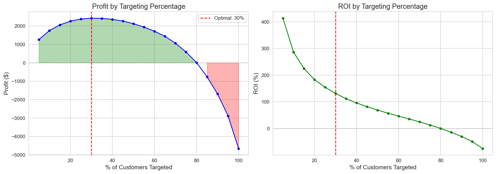
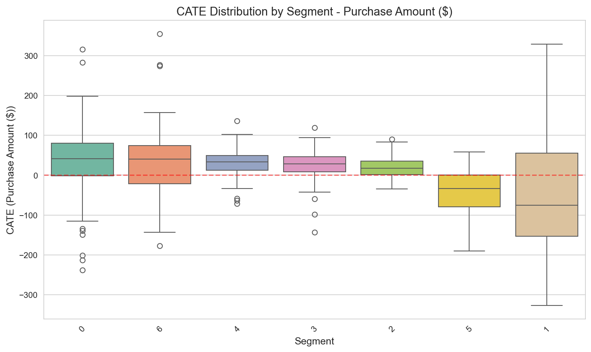
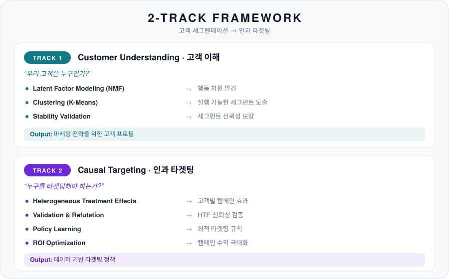
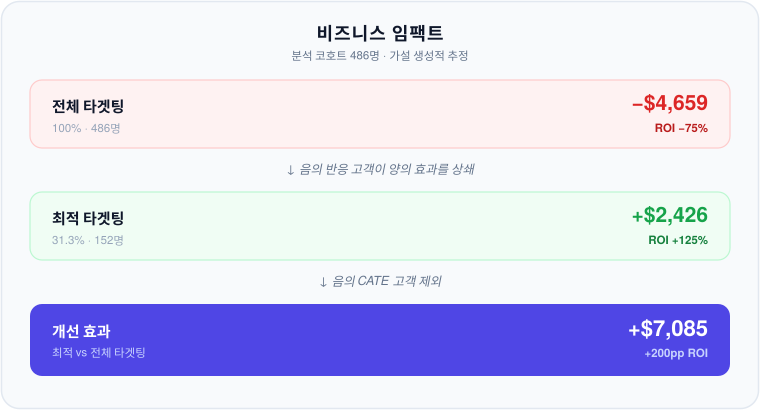
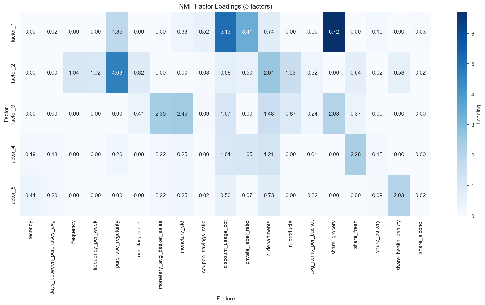
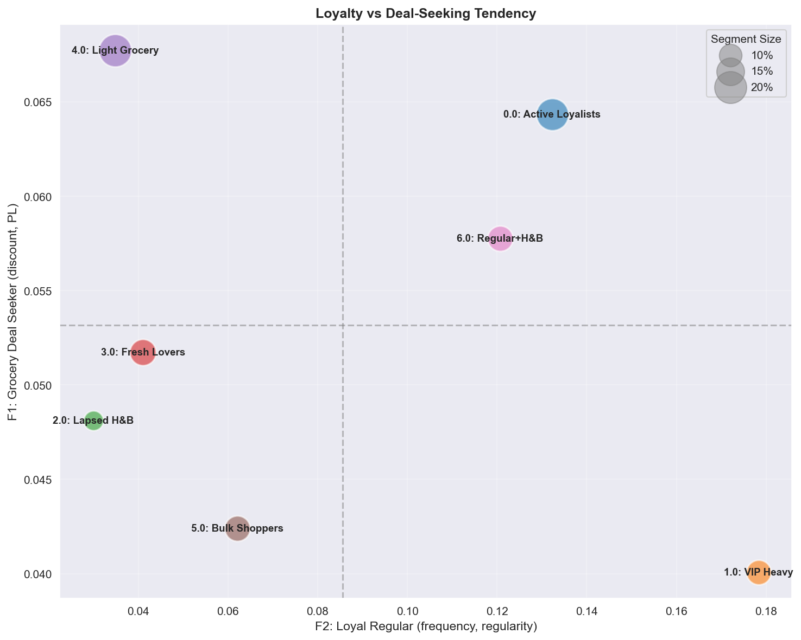
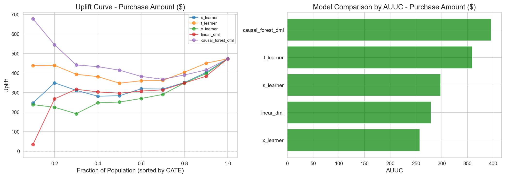
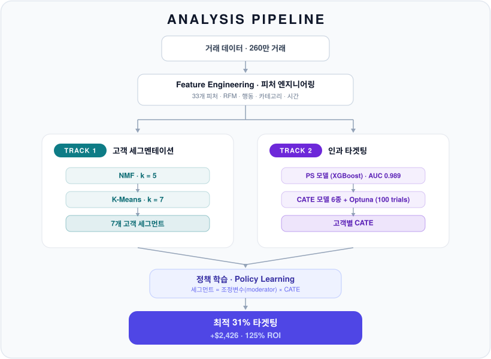
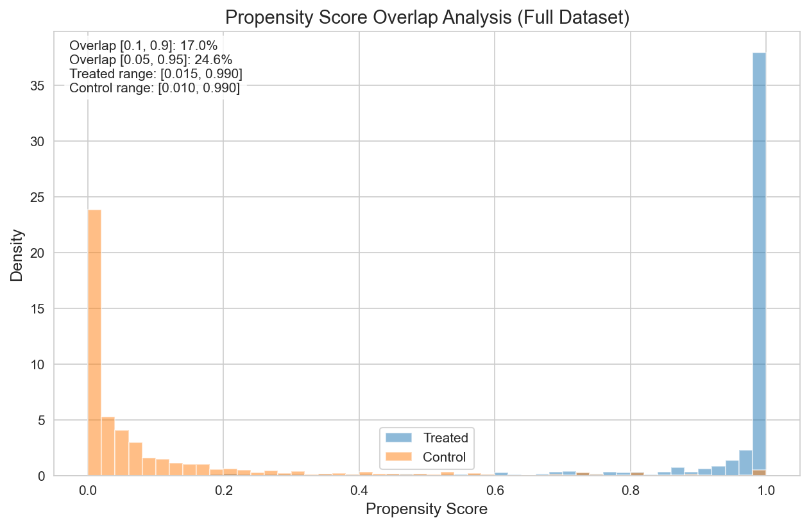

# Customer Segmentation & Causal Targeting — Dunnhumby

**🇰🇷 한국어** | [🇺🇸 English](README.en.md)


> **One-liner**: 2,500 가구 · 260만 거래 리테일 데이터에서 **7개 고객 세그먼트**를 정의하고, **이질적 처치효과(CATE)** 추정과 **정책 학습**으로 **수익을 극대화하는 최적 31% 타겟팅 규칙**을 도출한 End-to-End 분석.

---

## ⏱️ TL;DR (30초)

- **문제** — 쿠폰 캠페인(TypeA)을 누구에게 보낼 것인가? 전체 발송은 비용만 키우고 손실을 낸다.
- **접근** — **2-Track Framework**. Track 1은 *"우리 고객은 누구인가"*(NMF + K-Means → 7 세그먼트), Track 2는 *"누구를 타겟팅해야 하는가"*(CATE 추정 → 정책 학습).
- **핵심 결과 3줄**
  1. 고가치 세그먼트(VIP Heavy, Bulk Shoppers)가 오히려 **음(-)의 CATE** → Ceiling/Cannibalization 효과.
  2. **CATE > Breakeven($42.43)** 규칙으로 코호트의 **31.3%(152/486)** 만 타겟팅하면 수익 최적.
  3. 관찰 데이터의 **심각한 Positivity Violation**(PS AUC=0.989, Overlap 17%) → 결과는 *가설 생성적*, **A/B Test로 확증 필요**.
- **임팩트 한 줄** — 전체 타겟팅(-$4,659) 대비 최적 타겟팅(+$2,426)으로 **+$7,085 / +200pp ROI** 개선(분석 코호트 기준, 가설 생성적 추정).

---

## 🎯 핵심 결과 한눈에

| 핵심 지표 | 값 | 비고 |
|----------|-----|------|
| 데이터 규모 | 2,500 가구 · ~2.6M 거래 · 102주 | Dunnhumby "The Complete Journey" |
| 세그먼트 수 | **7** (NMF k=5 → K-Means k=7) | 분산 설명 92.44%, Bootstrap ARI 0.77±0.11 |
| Breakeven CATE | **$42.43** | 비용 $12.73 / 마진 0.30 |
| 최적 타겟팅 | **31.3% (152 / 486)** | profit **+$2,426**, ROI **125%** |
| 전체 타겟팅(100%) | 486명 | profit -$4,659, ROI -75% |
| 현행 관행(62.1%) | 302명 | profit -$3,402, ROI -88% |
| 개선 효과(최적 vs 전체) | **+$7,085** | +200pp ROI (가설 생성적) |
| Positivity 진단 | PS AUC **0.989**, Overlap **17%** | 심각한 위반 → 가설 생성적 해석 |
| 1차 CATE 모델 | **CausalForestDML** | 저분산·타당성 기준 선택(자세히는 Track 2) |

**ROI 곡선 — 31.3%에서 최적, 100% 타겟팅은 손실**


*타겟팅 비율별 ROI. **31.3%에서 최적(125% ROI)**, 100% 타겟팅 시 **-75% ROI로 손실** 발생.*

**세그먼트별 CATE — 고가치 세그먼트의 음(-)의 효과가 반직관적 핵심**


*세그먼트별 CATE 분포. **VIP Heavy(-$38)와 Bulk Shoppers(-$40)의 음의 효과**가 명확하다 — 타겟팅 축소 신호.*

### 🧭 목차

| 레이어 | 섹션 |
|--------|------|
| 30초 | [TL;DR](#️-tldr-30초) · [핵심 결과 한눈에](#-핵심-결과-한눈에) |
| 5분 | [Motivation & Framework](#motivation--framework) · [Key Insights](#key-insights-반직관적-발견) · [Results Summary](#results-summary) · [Limitations](#limitations--lessons-learned) |
| 재현 | [Quick Start](#quick-start--재현-방법) · [Repository Structure](#repository-structure) · [Technical Reports](#technical-reports) |
| 30분 | [Methodology](#methodology) · [Appendix](#appendix) |

---

## Motivation & Framework

본 프로젝트는 전통적 세그멘테이션의 *"우리 고객은 누구인가?"* 라는 질문과, 인과추론 기반의 *"이 캠페인이 누구에게 얼마나 효과가 있을까?"* 라는 질문을 하나의 파이프라인에서 함께 다룬다.



**왜 두 Track 모두 필요한가?**

| 측면 | Track 1 (Descriptive) | Track 2 (Causal) |
|------|----------------------|------------------|
| 핵심 질문 | "이 고객은 누구인가?" | "이 고객에게 캠페인이 효과적일까?" |
| 주요 사용자 | 마케팅, CRM, 전략 | Data Science, 최적화 |
| 설명 가능성 | "Premium Fresh Lover 세그먼트" | "이 고객의 CATE = +$34" |
| 조직 요구사항 | 고객 이해 기반 마케팅 역량 | Causal thinking + 개인화 타겟팅 실행 체계 |

---

## Key Insights: 반직관적 발견

### 고가치 고객의 음(-)의 Treatment Effect

> 아래 N은 **Track 2 분석 코호트(486명)** 기준이며, Track 1의 전체 세그먼트 규모(509·299·…)와는 다른 수치다. CATE는 가설 생성적 추정치다.

| 세그먼트 | 고객 가치(전체 평균 매출) | Mean CATE | N (코호트) | 방향 신호 |
|----------|--------------------------|-----------|-----------|----------|
| **VIP Heavy** | $9,716 (최고) | **-$38** | 59 | **축소 / TypeA 제외** |
| **Bulk Shoppers** | $3,206 | **-$40** | 77 | **축소 / TypeA 제외** |

**왜 고가치 고객이 음의 CATE를 보이는가?**

| 세그먼트 | 원인 분석 |
|----------|----------|
| **VIP Heavy** | 이미 High Purchaser → **Ceiling Effect**, 쿠폰이 기존 구매를 대체 (Cannibalization) |
| **Bulk Shoppers** | 쿠폰 기반 TypeA가 비정기 대량 구매 쇼핑 리듬과 **미스매치** |

**비즈니스 임팩트(분석 코호트 486명 기준, 가설 생성적):**



---

## Results Summary

### Track 1 Results: Latent Factor Modeling + Clustering

**5개 Latent Factor 해석(NMF k=5, 분산 설명 92.44%):**

| Factor | 명칭 | 상위 Feature (loading) | 해석 |
|--------|------|------------------------|------|
| **F1** | Grocery Deal Seeker | share_grocery(6.72), discount_usage_pct(5.13), private_label_ratio(3.41) | 할인 추구 예산 중시 |
| **F2** | Loyal Regular | purchase_regularity(4.63), n_departments(2.61), n_products(1.53), frequency(1.04) | One-stop 고관여 (Value) |
| **F3** | Big Basket | monetary_std(2.45), monetary_avg_basket(2.35), share_grocery(2.08) | 비정기 대량 구매 (Value) |
| **F4** | Fresh Focused | share_fresh(2.26), n_departments(1.21) | 신선식품 전문가 (Need) |
| **F5** | Health & Beauty | share_health_beauty(2.03), recency(0.41) | 드럭스토어 유형 (Need) |


*5개 Latent Factor의 Feature Loading. F2(Loyal)와 F3(Big Basket)이 **Value 차원**, F4(Fresh)와 F5(H&B)가 **Need 차원**을 포착한다.*

**Clustering 평가 메트릭(요약):**

| 메트릭 | 값 | 해석 |
|--------|-----|------|
| Explained Variance | 92.44% | 높은 Factor 커버리지 |
| Silhouette Score (k=7) | 0.219 | 행동 데이터로서 적절 (전역 최댓값은 아님 — 부록 참조) |
| Calinski-Harabasz (k=7) | 732.0 | — |
| Davies-Bouldin Index (k=7) | **1.241** | **k 후보 중 최소(최적 분리)** |
| Bootstrap ARI | 0.77 ± 0.11 (n=100) | 높은 세그먼트 안정성 |

> **k 선택의 정직한 근거**: Silhouette는 실제로 낮은 k(k=3=0.271)에서 가장 높다. k=7은 **DBI 최소(1.241)** + **비즈니스 해석가능성/실행가능성** + **높은 부트스트랩 안정성(ARI 0.77)** 을 근거로 선택했다. "Silhouette가 k=7에서 최고"라고 주장하지 않는다. (전체 grid는 [부록 A](#appendix-a-clustering-k-선택-grid)).

**7개 고객 세그먼트(전체 2,500명 기준):**

| Seg | 명칭 | 규모 | 평균 매출 | Frequency(방문) | Recency(일) | Regularity | 주요 Factor |
|-----|------|------|----------|-----------------|-------------|-----------|------------|
| 0 | Active Loyalists | 509 (20.4%) | $3,878 | 171 | 6 | 0.78 | F2 (Loyal) |
| 1 | **VIP Heavy** | 299 (12.0%) | **$9,716** | 256 | 4 | 0.88 | F2 (Loyal) |
| 2 | Lapsed H&B | 193 (7.7%) | $872 | 37 | 75 | 0.25 | F5 (H&B) |
| 3 | Fresh Lovers | 339 (13.6%) | $1,233 | 48 | 36 | 0.34 | F4 (Fresh) |
| 4 | Light Grocery | 524 (21.0%) | $942 | 43 | 42 | 0.30 | F1 (Grocery-Deal) |
| 5 | **Bulk Shoppers** | 318 (12.7%) | $3,206 | 56 | 24 | 0.41 | F3 (Basket) |
| 6 | Regular + H&B | 318 (12.7%) | $3,393 | 152 | 12 | 0.70 | F2 (Loyal) |

> Light Grocery(Seg 4)는 grocery share(0.56) + discount(0.51)가 **F1(Grocery-Deal)** 에 적재되어 주요 Factor를 F1으로 표기한다.


*Loyalty (F2) × Deal-Seeking (F1) 포지셔닝. VIP Heavy는 **High Loyalty + Low Deal** (프리미엄 충성), Active Loyalists는 **High Loyalty + High Deal** (예산 중시 충성).*

**세그먼트별 마케팅 전략 (Track 1 기반):**

| 세그먼트 | 우선순위 | 전략 | 주요 액션 |
|----------|----------|------|----------|
| VIP Heavy | High | Retention | 프리미엄 혜택, Churn 예측, 독점 접근 |
| Active Loyalists | High | Strengthen | PB 프로모션, 로열티 포인트, 장바구니 확대 |
| Regular + H&B | Medium | Upgrade | VIP 전환 프로그램, Cross-category 인센티브 |
| Bulk Shoppers | Medium | Regularize | 구독 제안, 정기 배송, 번들 딜 |
| Fresh Lovers | Medium | Engage | 신선식품 콘텐츠, 일일 특가, 레시피 |
| Light Grocery | Low | Activate | 습관 형성 캠페인, 점진적 보상 |
| Lapsed H&B | Low | Win-back | 재관여 캠페인, H&B 집중 오퍼 |

> 💡 **Track 1 vs Track 2 전략 차이**: Track 1은 고객 특성 기반 일반 전략, Track 2는 CATE 기반 TypeA 캠페인 타겟팅 전략이다. VIP Heavy는 Track 1에서 "Retention"이지만, Track 2에서는 TypeA 타겟팅 "축소" 권고로 갈린다.

### Track 2 Results: CATE 및 최적 타겟팅

**ATE 추정 (방법별, n=2,430):**

| 방법 | ATE | 95% CI | 신뢰성 |
|------|-----|--------|--------|
| Naive | +$471 | [$442, $501] | ❌ 상향 편향 |
| IPW | +$151 | [-$10, $313] | ⚠️ 불안정 |
| AIPW | +$24 | [-$56, $104] | ✅ Doubly-robust |
| OLS | +$65 | [$29, $102] | — |
| DML | -$65 | [-$220, $90] | ⚠️ 방향 반전 |
| **ATO (Overlap)** | **+$60** | [-$14, $134] | ✅ Overlap 집중 |

> 방법 간 추정치가 -$65 ~ +$471로 크게 흩어진다 — 이는 Positivity Violation의 직접적 증상이며, Overlap 집중 추정치(ATO +$60)와 doubly-robust 추정치(AIPW +$24)를 더 신뢰한다.

**CATE 모델 성과 (main run; test set):**

| 모델 | 평균 CATE | Test Std | AUUC | % positive | 선택 |
|------|-----------|----------|------|------------|------|
| **CausalForestDML** | **+$15** | **$52** | 271.6 | 78% | ✅ **Primary** |
| LinearDML | -$139 | $452 | **357.0** | 42% | ❌ 최고 AUUC이나 불안정 |
| NonParamDML | +$1.1M (발산) | 매우 큼 | 304.4 | 64% | ❌ 발산 |
| S-Learner | -$21 | $46 | 289.5 | 21% | ❌ 79% 음수효과(비현실적) |
| X-Learner | -$96 | $208 | 218.5 | 38% | ❌ 높은 분산 |
| T-Learner | -$200 | $397 | 212.0 | 43% | ❌ 높은 분산 |

> **모델 선택 근거(정직한 reframe)**: CausalForestDML은 **AUUC 최고가 아니다**. main run에서 AUUC 최고는 **LinearDML(357.0)** 이고 CausalForestDML은 4위(271.6)다. 그럼에도 CausalForestDML을 1차 모델로 택한 이유는 **저분산(std $52 vs LinearDML $452)** 과 **타당한 CATE 분포(평균 +$10~15, 78% 양수 — 캠페인 목적과 정합)** 를 **동시에** 만족하는 *유일한* 모델이기 때문이다. AUUC가 더 높은 모델들은 사용 불가하다: LinearDML(평균 -$139, std $452), NonParamDML(발산), S-Learner는 분산은 비슷하나 고객의 **79%가 음의 효과**라는 비현실적 분포를 함의한다. **심각한 Positivity Violation 하에서는 raw AUUC보다 안정성·타당성을 우선**한다. (보조 근거: BLP test p=0.094 경계, X-Learner p=0.005 — 이질성 신호는 약하다. 자세히는 Track 2 보고서.) 전체 코호트(486명)에 대한 CausalForestDML 평균 CATE는 **+$10**으로 일관된다.


*CATE 모델별 AUUC 비교. 안정성·타당성 기준으로 선택된 CausalForestDML의 uplift 곡선. **상위 30% 타겟팅 시 $2,200+ 추가 수익** 예상.*

#### 세그먼트별 CATE 및 권장 액션

> N은 **Track 2 분석 코호트(486명)** 기준이며 Track 1 전체 세그먼트 규모와 다르다. "현재/권장 타겟팅 %"는 원천 CSV에 없는 값이므로 **방향성(확대/유지/축소)** 으로만 제시한다.

| 세그먼트 | N (코호트) | Mean CATE | 권장 액션 (방향) |
|----------|-----------|-----------|------------------|
| Active Loyalists | 97 | **+$33** | Test & Learn (소폭 확대) |
| Regular + H&B | 62 | **+$34** | Test & Learn (소폭 확대) |
| Light Grocery | 91 | **+$30** | Test & Learn (확대) |
| Fresh Lovers | 73 | **+$27** | Test & Learn (확대) |
| Lapsed H&B | 27 | +$19 | Test & Learn |
| **VIP Heavy** | 59 | **-$38** | **축소 / TypeA 제외** |
| **Bulk Shoppers** | 77 | **-$40** | **축소 / TypeA 제외** |


*세그먼트별 CATE 분포. **VIP Heavy(-$38)와 Bulk Shoppers(-$40)의 음의 효과**가 명확하다.*

#### Policy 비교 분석 (486 코호트)

| Policy | 기준 | Target % (N) | Profit | ROI | 특징 |
|--------|------|--------------|--------|-----|------|
| **CATE > Breakeven** | Point est. > $42.43 | **31.3% (152)** | **+$2,426** | **125%** | ✅ 최적 |
| Top 20% CATE | Percentile | 20.0% (97) | +$2,259 | **183%** | 예산 제약 시 최고 ROI |
| Conservative | Lower CI > $42.43 | 0.6% (3) | +$188 | 493% | 초보수(A/B 전) |
| Risk-Adjusted (30%) | 위험 조정 | 11.1% (54) | +$1,603 | 233% | 분산 페널티 |
| PolicyTree (Tuned) | 학습된 규칙 | 26.7% (130) | +$1,684 | 102% | 해석 가능 |
| CATE > 0 | Point est. > 0 | 64.6% (314) | +$1,447 | 36% | 느슨한 규칙 |
| 현행 관행 | — | 62.1% (302) | **-$3,402** | **-88%** | ❌ 손실 |
| **전체 타겟팅** | — | 100% (486) | **-$4,659** | **-75%** | ❌ **손실** |


*타겟팅 비율별 ROI. **31.3%에서 최적(125% ROI)**, 100% 타겟팅 시 **-75% ROI로 손실** 발생.*

---

## Limitations & Lessons Learned

| 한계 | 증거 | 완화책 |
|------|------|--------|
| **Positivity Violation** | PS AUC = 0.989, Overlap 17% | PS Trimming, ATO Weighting, Manski Bounds, 부분 식별 |
| **Refutation Test 실패** | Placebo(Amount) 0.747 (>0.5 → FAIL), Subset Stability 0.561 (<0.7 → FAIL) | A/B Test 검증 설계 (n=5,748) |
| **모델 불일치** | CausalForest +$10 vs LinearDML -$139 | 안정성·타당성 기준 선택, 방향 불일치 인정 |
| **단일 캠페인 유형** | TypeA만 분석 | TypeB/C 별도 분석 필요 |

> **Refutation은 실패했다 — 그리고 그것은 예상된 결과다.** Placebo Treatment(Amount)=0.747(임계 <0.5)와 Subset Stability=0.561(임계 >0.7)은 모두 임계를 통과하지 못했다(단, Placebo-Visits=0.052는 통과). 이는 Positivity Violation 하에서 **예상되는** 신호이며, 결과를 *확증적*이 아닌 *가설 생성적*으로 다뤄야 함을 뒷받침한다. 결과는 숨기거나 완화하지 않는다.

### 교훈

> "PS AUC 0.989는 Observational Study의 근본적 한계를 보여준다.
> 결과를 **가설 생성적(hypothesis-generating)**으로 해석하고,
> **A/B Test로 검증 후 배포**해야 한다."

### 향후 방향

1. **A/B Test 검증**: n=5,748 (2,874/arm, 80% Power, α=0.05, 탐지 가능 효과 ~$34)으로 가설 검증.
2. **ε-greedy Exploration**: 모든 고객에 최소 ε 확률로 treatment 할당 → Positivity 보장.
3. **MLOps 확장**: CATE 모니터링 대시보드, 모델 재훈련 파이프라인.

---

## Quick Start / 재현 방법

```bash
# 1) 저장소 클론
git clone <repo-url>
cd kr_segmentation_causal_targeting_dunnhumby

# 2) 의존성 설치 (Python 3.12 권장)
pip install -r requirements.txt

# 3) 데이터 준비 (아래 'Data Source & Attribution' 참조)
#    Dunnhumby "The Complete Journey" 원본 CSV를 data/dunnhumby/raw/ 에 배치
#    (라이선스상 본 저장소에는 원본 데이터를 재배포하지 않음)

# 4) 노트북을 순서대로 실행 (각 단계는 이전 산출물에 의존)
#    00 → 01 → 02 (Track 1)  →  03a → 03b → 04 (Track 2)
jupyter lab notebook/
```

**노트북 실행 순서**

```
00_study_design → 01_feature_engineering → 02_customer_profiling      (Track 1)
                                         → 03a_hte_estimation
                                         → 03b_hte_validation
                                         → 04_optimal_policy           (Track 2)
```

**산출물 위치**

| 위치 | 내용 |
|------|------|
| `results/figures/` | 시각화 PNG (PS overlap, factor loadings, uplift, ROI 곡선 등) |
| `results/tables/` · `results/*.csv` | 결과 테이블 (ATE/CATE, policy comparison, segment recommendations, breakeven scenarios 등) |
| `data/dunnhumby/processed/` | 정제·파생 데이터 (features, NMF loadings, segment profiles) |

---

## Repository Structure

```
kr_segmentation_causal_targeting_dunnhumby/
├── notebook/                 # 분석 노트북 (00→01→02→03a→03b→04) + eda/
├── src/                      # Python 모듈
│   ├── features.py           #   33개 고객 Feature 구성
│   ├── segments.py           #   NMF + K-Means 세그멘테이션
│   ├── cohorts.py            #   Treatment/Control 코호트 정의
│   ├── treatment_effects.py  #   ATE/CATE 추정, Positivity 진단
│   ├── policy.py             #   Policy Learning, DR/IPW Value
│   ├── business.py           #   ROI 곡선, breakeven, 타겟팅 우선순위
│   ├── metrics.py            #   Uplift 메트릭 (AUUC, Qini)
│   ├── plots.py              #   시각화 함수
│   ├── ray_utils.py          #   Ray 병렬 CATE 학습, Optuna 튜닝
│   ├── preprocess.py         #   원본 거래 데이터 로딩/전처리
│   └── utils.py              #   보조 헬퍼
├── docs/                     # 기술 보고서 + 용어집 + 가정 문서
├── data/dunnhumby/           # raw/ (원본 CSV) · processed/ (정제 데이터)
├── results/                  # figures/ (PNG) · tables/ (CSV)
└── requirements.txt
```

---

## Technical Reports

자세한 방법론, 결과, 비즈니스 해석은 다음을 참조한다:

- **[Track 1 Report (KR)](docs/track1_report.md)** · [EN](docs/track1_report.en.md) — Customer Segmentation Analysis
  - NMF Factor 해석, 세그먼트 프로필, 세그먼트별 마케팅 액션
- **[Track 2 Report (KR)](docs/track2_report.md)** · [EN](docs/track2_report.en.md) — Causal Targeting Analysis
  - Positivity Diagnostics, CATE 추정, Policy 비교, A/B Test 설계
- **[Positivity Assumption](docs/positivity_assumption.md)** — Positivity Violation 진단·완화 상세
- **[Glossary](docs/GLOSSARY.md)** — 핵심 용어 정의 (CATE, AUUC, ATO, Manski Bounds 등)

---

## Notebooks

### Track 1: Customer Segmentation

| 노트북 | 설명 |
|--------|------|
| [00_study_design.ipynb](notebook/00_study_design.ipynb) | Study Design 및 2-Track Framework |
| [01_feature_engineering.ipynb](notebook/01_feature_engineering.ipynb) | 33개 고객 Feature 구성 |
| [02_customer_profiling.ipynb](notebook/02_customer_profiling.ipynb) | NMF Latent Factor + K-Means Segmentation |

### Track 2: Causal Targeting

| 노트북 | 설명 |
|--------|------|
| [03a_hte_estimation.ipynb](notebook/03a_hte_estimation.ipynb) | 다양한 방법을 통한 ATE/CATE 추정 |
| [03b_hte_validation.ipynb](notebook/03b_hte_validation.ipynb) | 검증, Refutation Test, Bounds |
| [04_optimal_policy.ipynb](notebook/04_optimal_policy.ipynb) | Policy Learning 및 ROI 최적화 |

### Source Modules (`src/`)

| Module | Description |
|--------|-------------|
| `features.py` | 33개 고객 Feature 추출 (RFM, Behavioral, Category, Time) |
| `segments.py` | NMF Latent Factor + K-Means 세그멘테이션 |
| `cohorts.py` | 캠페인별 Treatment/Control 코호트 구성 |
| `treatment_effects.py` | ATE/CATE 추정, Positivity 진단, Manski Bounds |
| `policy.py` | Policy Learning (IPW/DR Value Estimation) |
| `metrics.py` | Uplift 메트릭 (AUUC, Qini) |
| `business.py` | ROI 계산, 세그먼트별 권고 |
| `plots.py` | HTE/Policy 시각화 함수 |
| `ray_utils.py` | Ray 병렬 CATE 학습, Optuna 100 trials 튜닝 |
| `preprocess.py` | 원본 거래 데이터 로딩/전처리 |

---

## Technical Stack

- **Data Processing**: pandas, numpy
- **Machine Learning**: scikit-learn, xgboost
- **Causal Inference**: econml, dowhy, statsmodels
- **Optimization**: Optuna (hyperparameter tuning), Ray (parallelization)
- **Visualization**: matplotlib, seaborn

---

## Data Source & Attribution

**Dunnhumby "The Complete Journey"**
- 102주간 **2,500 가구**, **~2.6M (2,595,732) 거래**
- 캠페인 데이터 (TypeA/B/C), 쿠폰 Redemption
- Demographic 세그먼트

본 데이터셋은 dunnhumby가 연구·교육 목적으로 공개한 "The Complete Journey" 데이터다. **라이선스 정책에 따라 원본 데이터는 본 저장소에 재배포하지 않으며**, 사용자가 직접 내려받아 `data/dunnhumby/raw/`에 배치해야 한다.

데이터셋 문서 및 출처: [data/dunnhumby/README.md](data/dunnhumby/README.md)

---

## Methodology

> 30초·5분 요약을 넘어 방법론의 수식·결정 근거를 보려는 독자를 위한 상세 섹션이다.

### Analysis Pipeline



**Temporal split**: pre-period 주 1–31 (공변량 구성), campaign/outcome 주 32–102.

### Track 1: Customer Segmentation

> **Why NMF + K-Means?**
> - **해석력**: 비음수 제약으로 직관적인 Factor 해석 가능 → 마케팅 관계자와 소통 용이
> - **빠른 반복 실험**: 파라미터 튜닝 및 실험 반복이 빠름 → 세그먼트 정의를 지속적으로 수정/개선
> - 고객 세그멘테이션은 마케팅 팀과의 협업이 핵심이므로, 복잡한 모델보다 **소통 가능한 해석력**과 **빠른 실험 사이클**이 중요

**NMF (Non-negative Matrix Factorization)**

```
V ≈ W × H

- V: 고객-Feature 행렬 (n × m)
- W: 고객-Factor 행렬 (n × k)  → 고객별 Factor Score
- H: Factor-Feature 행렬 (k × m) → Factor의 Feature 가중치
```

**K-Means Clustering**

```
min Σᵢ Σⱼ ||wᵢ - μⱼ||²

- wᵢ: 고객 i의 Factor Score 벡터 (from W)
- μⱼ: 클러스터 j의 중심 (centroid)
- 목표: 클러스터 내 분산 최소화
```

**의사결정 근거:**

| 결정 | 선택 | 근거 |
|------|------|------|
| Factor 수 (k) | **5** | Elbow Method + 92.44% 분산 설명 |
| 정규화 | MinMax [0,1] | NMF 비음수 제약 조건 충족 |
| Clustering | K-Means (k=7) | DBI 최소 (1.241) + 해석가능성 + Bootstrap 안정성 |
| 안정성 검증 | Bootstrap 100회 | ARI = 0.77 ± 0.11 |

### Track 2: Causal Targeting

**CATE (Conditional Average Treatment Effect)**

```
τ(x) = E[Y(1) - Y(0) | X = x]

- Y(1): Treatment를 받을 경우의 Potential Outcome
- Y(0): Treatment를 받지 않을 경우의 Potential Outcome
- X: Pre-treatment Covariates
```

**Breakeven CATE:**
```
Breakeven = Cost / Margin = $12.73 / 0.30 = $42.43

→ CATE > $42.43인 고객만 타겟팅 시 수익
```

**의사결정 근거:**

| 결정 | 선택 | 근거 |
|------|------|------|
| Study Design | First Campaign Only | Clean causal ID (Pre-treatment contamination 방지) |
| CATE 모델 | **CausalForestDML** | 저분산(std $52) + 타당한 CATE 분포(78% 양수). AUUC 최고는 아님(LinearDML 357.0이나 불안정) |
| Policy | CATE > Breakeven | 31.3% 타겟팅, +$2,426 수익 |
| 검증 | A/B Test 설계 | n=5,748 (2,874/arm, 80% Power, 탐지 가능 효과 ~$34) |

**Positivity 진단 및 대응:**

| 진단 | 값 | 의미 | 대응 |
|------|-----|------|------|
| PS AUC | **0.989** | Treatment가 거의 완벽히 예측됨 | Overlap 영역 집중 |
| Overlap [0.1, 0.9] | **17%** | 83%는 외삽 필요 | PS Trimming |
| Balanced Covariates | 9/21 | 대다수 불균형 | ATO Weighting |
| Manski Bounds | 넓은 비식별 구간 | 점추정 불가 | 보수적 부분 식별 해석 |


*Treatment/Control 간 PS 분포. **17%만 Overlap 영역**에 존재하여 심각한 Positivity Violation을 보인다.*

---

## Appendix

> 가장 밀도 높은 자료(파라미터 grid, 민감도, 모델 수학)를 모았다. 30초 → 5분 → 30분 순서로 깊이 들어갈 수 있다.

### Appendix A: Clustering k 선택 Grid

`clustering_metrics.csv` 전체 — DBI는 **k=7에서 최소(1.241)**. Silhouette는 낮은 k에서 더 높으므로, k=7은 DBI 최소 + 비즈니스 해석가능성 + 부트스트랩 안정성의 종합 판단이다.

| k | Silhouette | Calinski-Harabasz | Davies-Bouldin |
|---|------------|-------------------|----------------|
| 3 | **0.271** | **984.9** | 1.256 |
| 5 | 0.225 | 794.2 | 1.321 |
| 6 | 0.207 | 756.3 | 1.342 |
| **7** | 0.219 | 732.0 | **1.241** ← 선택 |
| 8 | 0.209 | 700.2 | 1.244 |

### Appendix B: Breakeven 민감도 (`breakeven_scenarios.csv`)

| 시나리오 | Cost | Margin | Breakeven | Target % | Profit |
|----------|------|--------|-----------|----------|--------|
| **Base** | $12.73 | 30% | $42.43 | 31.3% | **+$2,426** |
| 낮은 마진 | $12.73 | 25% | $50.92 | 26.1% | +$1,726 |
| 높은 마진 | $12.73 | 35% | $36.37 | 36.0% | +$3,173 |
| 높은 비용 | $15.00 | 30% | $50.00 | 26.5% | +$2,107 |
| 낮은 비용 | $10.00 | 30% | $33.33 | 39.7% | +$2,888 |
| Worst (15/25%) | $15.00 | 25% | — | — | +$1,461 |
| Best (10/35%) | $10.00 | 35% | — | — | +$3,702 |

> 모든 시나리오에서 최적 정책의 profit은 **양수**로 유지된다 — 결론은 비용·마진 가정에 강건하다.

### Appendix C: Refutation Test 상세

| 테스트 | 값 | 임계 | 결과 |
|--------|-----|------|------|
| Placebo Treatment (Amount) | 0.747 | < 0.5 | ❌ FAIL |
| Placebo Treatment (Visits) | 0.052 | < 0.5 | ✅ pass |
| Subset Stability | 0.561 | > 0.7 | ❌ FAIL |

> 실패는 Positivity Violation 하에서 예상되는 결과다. 결과는 가설 생성적이며 A/B Test로 확증해야 한다.

### Appendix D: CausalForestDML 이해

> **Note**: LinearDML은 R-Learner 논문(Nie & Wager, 2021)에서 직접 참조되나, CausalForestDML은 학술 논문에서 독립적으로 정의되지 않음. EconML 패키지가 DML + Causal Forest를 결합한 구현체.

#### 출처별 정리

| 아이디어 | 논문 | 핵심 |
|----------|------|------|
| **Causal Forest** | Athey & Wager (2018) | Honest splitting, local CATE 추정 |
| **DML** | Chernozhukov et al. (2018) | Cross-fitting, orthogonalization |
| **R-Learner** | Nie & Wager (2021) | 잔차 기반 CATE 추정 |

#### DML/R-Learner 공통 프레임워크

```
Step 1: Nuisance 추정 (비선형 ML 가능)
────────────────────────────────────
m(X) = E[Y|X]     ← XGBoost, RF 등
e(X) = E[T|X]     ← XGBoost, RF 등

Step 2: 잔차 계산
────────────────────────────────────
Ỹ = Y - m(X)      (outcome 잔차)
T̃ = T - e(X)      (treatment 잔차)

Step 3: CATE 추정 ← 여기서 차이 발생
────────────────────────────────────
min_τ E[(Ỹ - τ(X)·T̃)²]
```

#### LinearDML vs CausalForestDML

```
LinearDML:
──────────
τ(X) = X'β    (선형 함수)

→ min_β E[(Ỹ - X'β·T̃)²]
→ Weighted Least Squares로 β 추정


CausalForestDML:
────────────────
τ(X) = forest(X)    (비선형 함수)

→ min_forest E[(Ỹ - forest(X)·T̃)²]
→ Causal Forest로 τ(X) 직접 추정
```

#### 요약

| 구성 요소 | LinearDML | CausalForestDML |
|-----------|-----------|-----------------|
| Nuisance (Y~X, T~X) | XGBoost 등 비선형 OK | XGBoost 등 비선형 OK |
| **CATE 모델 τ(X)** | **선형** (X'β) | **비선형** (Forest) |

- **LinearDML**: nuisance는 비선형, CATE는 선형 → 해석 용이, 복잡한 HTE 패턴 제한. 본 데이터에서는 평균 -$139, std $452로 **불안정**.
- **CausalForestDML**: nuisance도 비선형, CATE도 비선형 → 복잡한 HTE 포착 가능. 본 데이터에서 평균 +$15, std $52로 **안정적**이라 1차 모델로 선택.

---

*License: MIT. 데이터는 dunnhumby의 라이선스를 따르며 본 저장소에 재배포되지 않는다.*
