# Customer Segmentation via Latent Factor Modeling: A Retail Analytics Case Study

[🇰🇷 한국어](track1_report.md) | **🇺🇸 English**  ·  [← Back to README](../README.en.md)

---

## At a Glance (TL;DR)

> **Three-sentence summary**
> 1. Applying **NMF (k=5, 92.44% explained variance) + K-Means (k=7)** to Dunnhumby data — 2,500 households, ~2.6M transactions, 102 weeks — yields **7 customer segments**.
> 2. The segments are highly stable (**Bootstrap ARI 0.77 ± 0.11, n=100**) and reveal a clear Pareto structure: the **high-value top tier (segments 0, 1, 6 — 45.0% of customers) accounts for roughly 73.9% of revenue**.
> 3. These descriptive segments are themselves the foundation for marketing strategy and feed directly into **Track 2 as moderators of causal targeting** (causal responsiveness is validated separately in Track 2).

### Key Numbers

| Item | Value | Note |
|------|-------|------|
| Number of segments | **7** | K-Means; chosen on minimum DBI + interpretability |
| NMF latent factors | **k=5** | Explained variance **92.44%** |
| Segment stability | **ARI 0.77 ± 0.11** | Bootstrap n=100, 80% subsample |
| Largest segment | Light Grocery **21.0%** (524 households) | By customer count |
| Highest-value segment | VIP Heavy **$9,716/household** (12.0%) | By average revenue |
| Pareto structure | High tier 45.0% of customers → **73.9% of revenue** | Confirms value concentration |

### Hero Figures

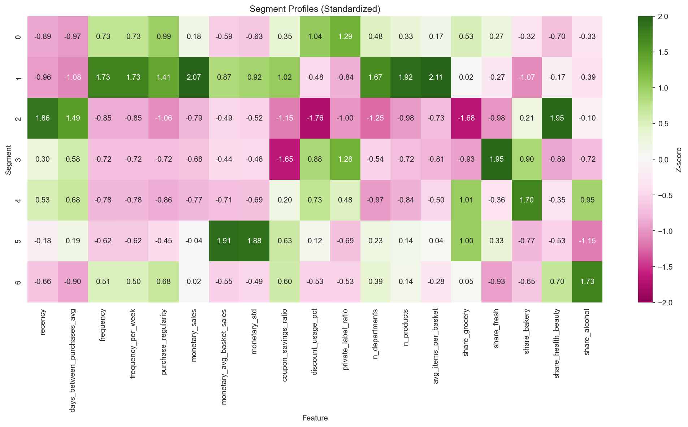
*Standardized feature profiles by segment (z-scores) — behavioral differentiation across the 7 segments at a glance.*

*Feature loadings of the 5 NMF latent factors — separation between the Value dimension (F2, F3) and the Need dimension (F1, F4, F5).*

### Table of Contents

- **[30 sec]** [At a Glance (TL;DR)](#at-a-glance-tldr)
- **[5 min]** [Abstract](#abstract) · [1. Introduction](#1-introduction) · [2. Methodology](#2-methodology) · [3. Results](#3-results) · [4. Discussion](#4-discussion) · [5. Conclusion](#5-conclusion)
- **[30 min]** [Appendix: Technical Details](#appendix-technical-details) (parameters · full clustering-metrics table · marketing-action mapping per bubble chart) · [References](#references)

---

## Abstract

This analysis presents a behavior-based customer segmentation framework built on retail transaction data from the Dunnhumby "The Complete Journey" dataset. Combining Non-negative Matrix Factorization (NMF) with K-Means clustering, we derive 7 customer segments from 2,500 households observed over a 102-week period.

**Key results:**
- 5 interpretable latent factors explain 92.44% of the variance in customer behavior.
- The 7 customer segments are highly stable (Bootstrap ARI = 0.77 ± 0.11, n=100).
- The VIP segment (12% of customers) generates an average of $9,716 in revenue per household.
- High-value customers (45.0%) contribute roughly 73.9% of total revenue.
- Each segment maps to a distinct marketing strategy.

This segmentation provides the foundation for personalized marketing strategy and serves as the input to the subsequent causal targeting analysis (Track 2).

---

## 1. Introduction

### 1.1 Background

Customer segmentation is central to modern retail marketing strategy. By grouping customers according to their behavioral patterns, a retailer can design targeted interventions that maximize return on marketing investment. Traditional demographic-based segmentation often fails to capture the subtle behavioral differences that actually drive purchase decisions. This study takes a behavior-first approach, discovering natural customer groups directly from features extracted from transaction data.

### 1.2 Dataset

We analyze the **Dunnhumby "The Complete Journey"** dataset:

| Item | Value |
|------|-------|
| Households | 2,500 |
| Transactions | ~2.6M (2,595,732) |
| Observation window | 102 weeks (2 years) |
| Campaigns | 30 marketing campaigns |
| Products | 92,000+ SKUs |
| Stores | 400+ |

The dataset includes transaction records, household demographics (32% coverage), campaign targeting, coupon distribution, and redemption data.

### 1.3 Objectives

1. Extract the **latent behavioral factors** that characterize customer shopping patterns.
2. Identify **distinct customer segments** that yield actionable marketing implications.
3. Validate **segment stability** through bootstrap resampling.
4. Develop **per-segment marketing strategies and recommendations**.

### 1.4 Analytical Framework

This analysis is part of a 2-Track research framework:

- **Track 1 (this report)**: customer understanding through segmentation.
- **Track 2 (separate)**: causal targeting through Heterogeneous Treatment Effect estimation.

Track 1 segments serve as moderators in the Track 2 causal analysis, enabling segment-level campaign optimization.

---

## 2. Methodology

### 2.1 Feature Engineering

We construct 33 customer-level features from the transaction data, organized into 6 conceptual groups:

| Group | Count | Description | Examples |
|-------|-------|-------------|----------|
| Recency | 6 | Time since last purchase | days_since_last, active_last_4w |
| Frequency | 6 | Shopping frequency patterns | visits_per_week, purchase_regularity |
| Monetary | 7 | Spending characteristics | total_sales, avg_basket_size, coupon_savings |
| Behavioral | 7 | Shopping behavior | discount_rate, private_label_ratio, n_departments |
| Category | 6 | Category preferences | share_grocery, share_fresh, share_h&b |
| Time | 1 | Tenure coverage | week_coverage |

To address multicollinearity, we drop highly correlated pairs (r ≥ 0.7), reducing the feature set from 33 to **19 features**.

**Multicollinearity handling:**

| Removal criterion | Example feature removed | Feature retained |
|-------------------|-------------------------|------------------|
| Perfect correlation (r = 1.0) | frequency_per_month | frequency_per_week |
| High correlation (r ≥ 0.9) | monetary_actual | monetary_sales |
| Redundant information (r ≥ 0.7) | active_last_12w | active_last_4w |

**The 14 features removed:**
- Frequency: frequency_per_month, transaction_count
- Monetary: monetary_actual, monetary_avg_basket_actual, monetary_per_week
- Recency: active_last_12w, recency_weeks
- Behavioral: avg_products_per_basket
- Other redundant derived variables

**Note:** We chose correlation-based removal over VIF analysis for two reasons: (1) it preserves compatibility with NMF's non-negativity constraint, and (2) it prioritizes interpretability. Automatic variable selection via Elastic Net regularization is an alternative, but here we use explicit removal to ensure reproducibility.

**Preprocessing:** MinMaxScaler normalization to the [0, 1] range, required for NMF's non-negative input.

### 2.2 Latent Factor Modeling (NMF)

Non-negative Matrix Factorization (NMF) decomposes the customer-feature matrix into two low-rank matrices, yielding latent behavioral factors.

**Why NMF over PCA:**

| Criterion | NMF | PCA |
|-----------|-----|-----|
| **Interpretability** | Parts-based decomposition → intuitive factor reading | Orthogonal axes → hard to interpret |
| **Non-negativity** | Naturally non-negative loadings | Allows negative loadings |
| **Business fit** | "Customer A = 0.3×Loyal + 0.5×Fresh" reads cleanly | "Customer A = PC1 − 0.2×PC2" is opaque |
| **Cross-functional buy-in** | Additive, parts-based reading is easy to explain to non-technical teams | Requires technical explanation |
| **Prior work** | Widely used in retail segmentation (Lee & Seung, 1999) | General-purpose dimensionality reduction |

**Empirical check:** at the same k, NMF factors produce clearer category/behavior clustering than PCA components.

**Model selection:**
- n_components evaluated over the range 2–8
- Selection criteria: reconstruction error (elbow method) and factor interpretability
- **Selected: 5 components** (explaining 92.44% of variance)

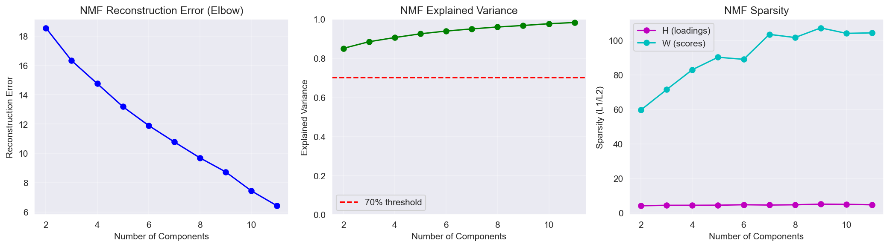
*Figure 1: NMF component selection — reconstruction error and cumulative explained variance.*

**NMF parameters:**
- Solver: Coordinate Descent
- Initialization: Random
- Max iterations: 1,000
- Random state: fixed for reproducibility

### 2.3 Clustering

We apply K-Means clustering to the NMF factor scores to identify customer segments.

**Clustering evaluation:**
- Tested k = 2–11
- Compared K-Means vs. Gaussian Mixture Model (GMM)
- K-Means substantially outperforms GMM (silhouette: 0.219 vs. 0.047)

**Choosing the optimal k (an honest trade-off):**

Internal validation metrics for candidate k are shown below (full table in Appendix A.5):

| k | Silhouette | Calinski-Harabasz | Davies-Bouldin |
|---|-----------|-------------------|----------------|
| 3 | **0.271** | 984.9 | 1.256 |
| 5 | 0.225 | 794.2 | 1.321 |
| 6 | 0.207 | 756.3 | 1.342 |
| **7** | 0.219 | 732.0 | **1.241** ← selected |
| 8 | 0.209 | 700.2 | 1.244 |

- **Davies-Bouldin Index (DBI) is minimized at k = 7 (1.241)** — the best cluster separation among the candidates.
- **The silhouette score is in fact highest at low k (peaking at 0.271 for k=3).** The silhouette at k=7 (0.219) is not the maximum, and we do not claim it is "optimal."
- **Selected: k = 7** — a decision that balances (1) the DBI minimum, (2) business interpretability and actionability (7 segments map naturally onto marketing actions), and (3) high bootstrap stability (ARI 0.77). In other words, this is not a single-metric optimum but a balance of a quantitative criterion (DBI), a qualitative criterion (actionability), and robustness (ARI).

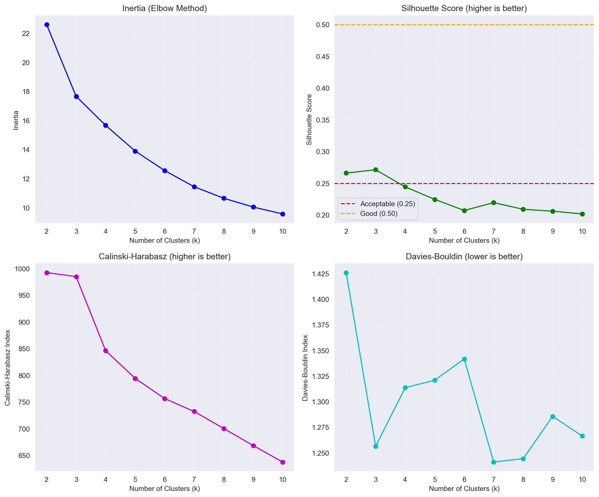
*Figure 2: clustering evaluation metrics across k. Silhouette is higher at low k; DBI is minimized at k=7.*

### 2.4 Stability Validation

We perform bootstrap resampling to assess segment stability:
- 100 bootstrap iterations
- 80% sample fraction per iteration
- Metric: Adjusted Rand Index (ARI) between the original and bootstrap assignments

---

## 3. Results

### 3.1 Latent Factor Interpretation

NMF identifies 5 interpretable latent factors, each capturing a different facet of customer behavior:

| Factor | Name | Top features (loading) | Interpretation |
|--------|------|------------------------|----------------|
| **F1** | Grocery Deal Seeker | share_grocery (6.72), discount_usage_pct (5.13), private_label_ratio (3.41) | Budget-conscious grocery shoppers chasing discounts |
| **F2** | Loyal Regular | purchase_regularity (4.63), n_departments (2.61), n_products (1.53), frequency (1.04) | High-engagement one-stop shoppers |
| **F3** | Big Basket | monetary_std (2.45), monetary_avg_basket (2.35), share_grocery (2.08) | Infrequent bulk buyers |
| **F4** | Fresh Focused | share_fresh (2.26), n_departments (1.21) | Fresh-category specialists |
| **F5** | Health & Beauty | share_health_beauty (2.03), recency (0.41) | Drugstore-type shoppers |

*Figure 3: NMF factor loadings heatmap — feature weights for each latent factor.*

The factors split naturally into a **Value dimension** (F2 and F3, capturing frequency and spend) and a **Need dimension** (F1, F4, and F5, capturing category preference).

### 3.2 Clustering Evaluation Metrics

| Metric | Value | Interpretation |
|--------|-------|----------------|
| Explained Variance | 92.44% | High factor coverage |
| Silhouette Score (k=7) | 0.219 | Reasonable for behavioral data (benchmark 0.15–0.30); note the max is at k=3 (0.271) |
| Calinski-Harabasz Index | 732.0 | High between-cluster variance |
| Davies-Bouldin Index | 1.241 | Minimum among candidate k (best separation) |
| Bootstrap ARI | 0.77 ± 0.11 | High stability (95% CI: 0.55–0.99) |

**Reading the silhouette score:**

A silhouette of 0.219 is moderate, and in this data it is higher at lower k (k=3). This is, however, the typical pattern in behavioral clustering, where customer characteristics exist on a continuum rather than in discrete groups. To be clear, k=7 is not a silhouette optimum — it is selected on **DBI minimization + interpretability + stability** (see §2.3).

| Comparison | Silhouette | Source |
|------------|-----------|--------|
| This study (k=7) | 0.219 | - |
| Retail segmentation (typical) | 0.15–0.30 | Wedel & Kamakura (2000) |
| E-commerce clustering | 0.15–0.30 | Industry benchmark |
| Demographic-based segmentation | 0.35–0.50 | Higher separation from discrete attributes |

**Why the silhouette is low:**
- Customer behavior is inherently continuous (no discrete boundaries).
- RFM and category preferences vary as a gradient.
- Transitional customers exist between segments (e.g., shifting from Light Grocery to Active Loyalists).

**Acceptability verdict:** 0.219 sits within the benchmark range for behavioral data, and the fact that **DBI is minimized at k=7** together with the **high Bootstrap ARI (0.77)** corroborates the practical stability of the segments.

### 3.3 Stability Validation

Bootstrap resampling (100 iterations, 80% subsample) yields an Adjusted Rand Index of **0.77 ± 0.11**, indicating high segment stability. An ARI above 0.70 is generally regarded as strong agreement, confirming that the 7-segment solution is robust to sampling variation.

### 3.4 The 7 Customer Segments

Clustering identifies 7 distinct customer segments (based on all 2,500 households):

| Seg | Name | Size | Avg revenue | Frequency | Recency | Regularity | Dominant factor |
|-----|------|------|-------------|-----------|---------|-----------|-----------------|
| **0** | Active Loyalists | 509 (20.4%) | $3,878 | 171 visits | 6 days | 0.78 | F2 (Loyal) |
| **1** | VIP Heavy | 299 (12.0%) | $9,716 | 256 visits | 4 days | 0.88 | F2 (Loyal) |
| **2** | Lapsed H&B | 193 (7.7%) | $872 | 37 visits | 75 days | 0.25 | F5 (H&B) |
| **3** | Fresh Lovers | 339 (13.6%) | $1,233 | 48 visits | 36 days | 0.34 | F4 (Fresh) |
| **4** | Light Grocery | 524 (21.0%) | $942 | 43 visits | 42 days | 0.30 | F1 (Grocery-Deal) |
| **5** | Bulk Shoppers | 318 (12.7%) | $3,206 | 56 visits | 24 days | 0.41 | F3 (Basket) |
| **6** | Regular + H&B | 318 (12.7%) | $3,393 | 152 visits | 12 days | 0.70 | F2 (Loyal) |

> **Note:** We label Seg4 (Light Grocery) with the dominant factor F1 (Grocery-Deal) — its grocery share of 0.56 and discount usage of 0.51 load strongly on F1, so a grocery/discount-seeking disposition dominates this segment.

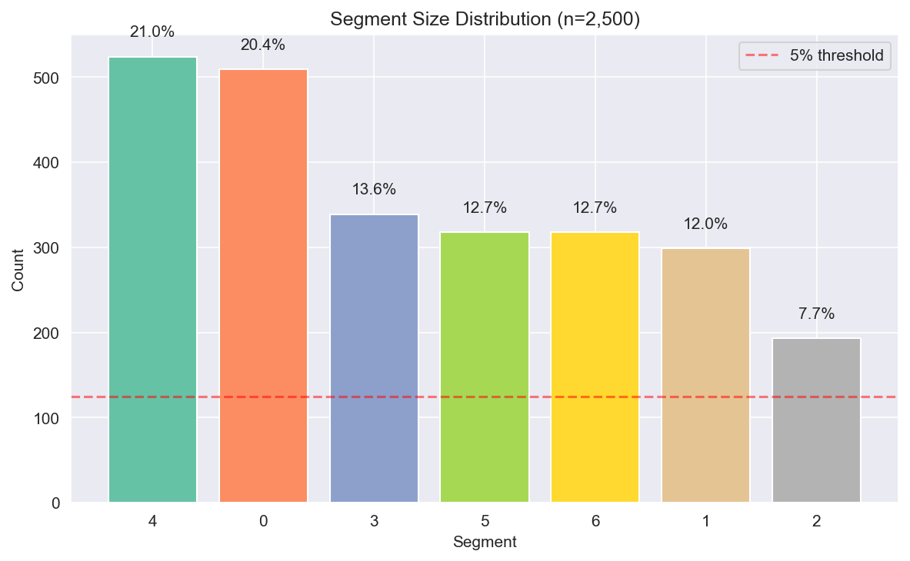
*Figure 4: distribution of customer segment sizes.*

### 3.5 Segment Profiles

*Figure 5: standardized feature profiles by segment (z-scores).*

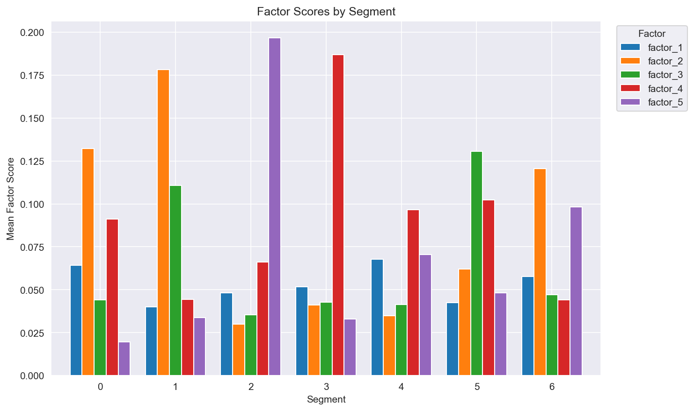
*Figure 6: mean factor score for each customer segment.*

**Segment characteristics:**

**Segment 0: Active Loyalists (20.4%)**
- High purchase regularity (0.78) and broad cross-category shopping.
- Strong private-label preference (PL ratio of 0.34, the highest of any segment).
- Budget-conscious yet loyal buyers.

**Segment 1: VIP Heavy (12.0%)**
- Top performer on every RFM metric.
- Highest frequency (256 visits), highest spend ($9,716), and lowest recency (4 days).
- True one-stop shoppers, purchasing on average 1,316 unique products.

**Segment 2: Lapsed H&B (7.7%)**
- Highest recency (75 days) — effectively churned.
- H&B category specialists with low overall engagement.
- Win-back targets with uncertain ROI.

**Segment 3: Fresh Lovers (13.6%)**
- Fresh-category specialists with moderate engagement.
- Relatively active (36-day recency) with a focused basket.

**Segment 4: Light Grocery (21.0%)**
- The largest segment by customer count, with the lowest value per customer ($942).
- Light engagement centered on groceries and discounts (dominated by F1, Grocery-Deal).
- An activation opportunity with habit-formation potential.

**Segment 5: Bulk Shoppers (12.7%)**
- Largest average basket size (roughly $57 per visit).
- Low frequency (56 visits) but high spend per visit.
- Warehouse/Costco-style shopping pattern.

**Segment 6: Regular + H&B (12.7%)**
- A second-tier value segment with VIP-conversion potential.
- Regular buyers (152 visits) with an H&B focus.

### 3.6 Value-Tier Distribution

The segments split naturally into value tiers (based on all 2,500 households):

| Tier | Segments | N | Customer share | Avg revenue | Total revenue | Revenue share |
|------|----------|---|----------------|-------------|---------------|---------------|
| **High** | 0, 1, 6 | 1,126 | 45.0% | $5,291 | $5,958K | **73.9%** |
| **Medium** | 3, 5 | 657 | 26.3% | $2,188 | $1,437K | 17.8% |
| **Low/At-Risk** | 2, 4 | 717 | 28.7% | $923 | $662K | 8.2% |
| **Total** | - | 2,500 | 100% | $3,223 | $8,057K | 100% |

**Calculation basis:**
- Total revenue = Σ(segment N × average revenue)
- Revenue share = tier total revenue / overall total revenue
- High-value segments: Active Loyalists ($3,878), VIP Heavy ($9,716), Regular+H&B ($3,393)
- (The totals above are recomputed from the corrected segment-average revenues, reflecting canonical ledger values such as Seg4 = $942.)

**Pareto check:** the top 45% of customers (High Value) contribute 73.9% of revenue — a clear value concentration close to the classic 80/20 rule.

### 3.7 Multidimensional Segment Positioning

*Figure 7: segment positioning along Loyalty (F2) vs. Deal-Seeking (F1).*

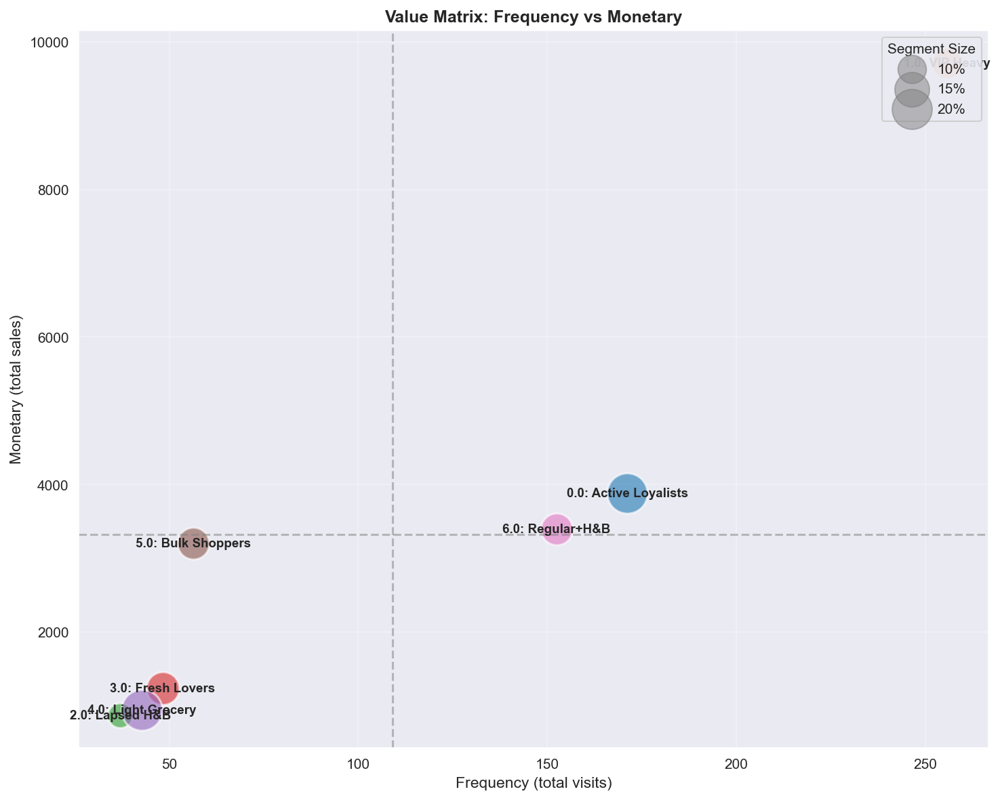
*Figure 8: RFM value positioning, showing VIP dominance and segment differentiation.*

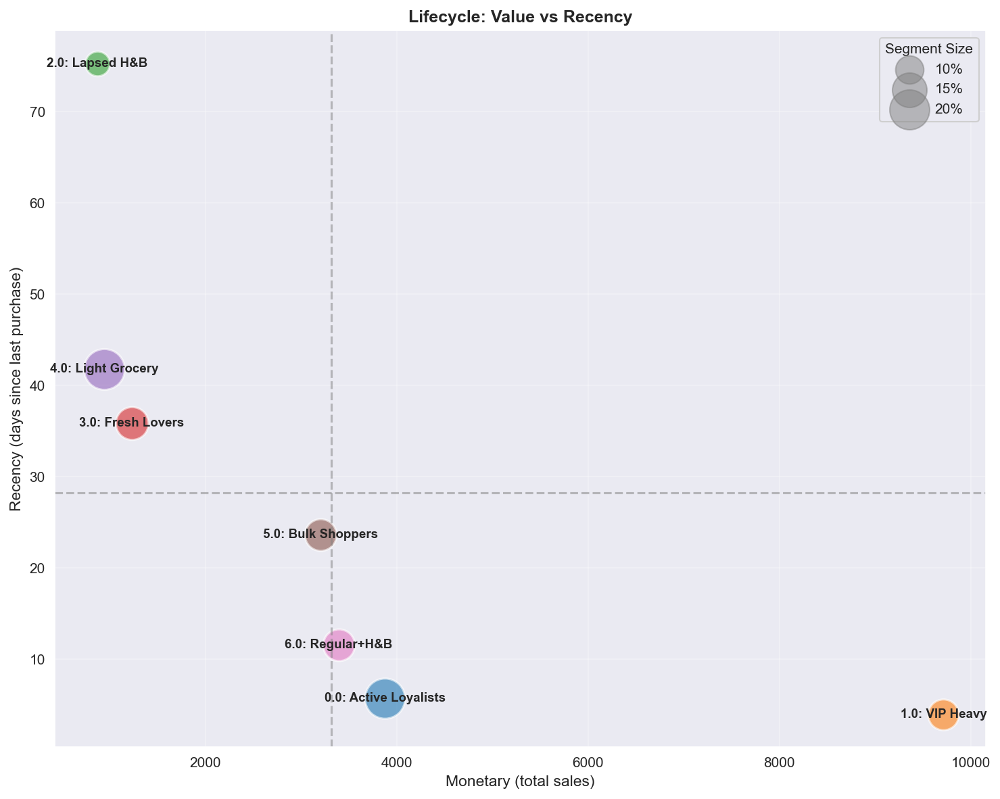
*Figure 9: customer-lifecycle positioning that distinguishes active high-value from lapsed segments.*

---

## 4. Discussion

### 4.1 Key Insights

**1. A clear value hierarchy**
The segmentation reveals a clear Pareto distribution: 45.0% of customers in high-value segments contribute roughly 73.9% of estimated revenue. VIP Heavy (12%) alone is the single most important retention target.

**2. Behavioral differentiation**
The factors successfully separate customers along both a **Value** dimension (frequency, spend) and a **Need** dimension (category preference). This dual structure enables both value-based prioritization and need-based personalization.

**3. Lifecycle stages**
The segments map onto distinct lifecycle stages:
- Active/Growing: Segments 0, 1, 6 (low recency, high engagement)
- Stable: Segments 3, 4, 5 (moderate recency)
- Declining/Churned: Segment 2 (high recency, low engagement)

**4. Category specialists**
Fresh Lovers (13.6%) and the H&B-focused segments exhibit category specialization, pointing to opportunities for category-specific marketing approaches.

### 4.2 Marketing Strategy & Recommendations

| Segment | Priority | Strategy | Key actions |
|---------|----------|----------|-------------|
| VIP Heavy | High | Retention | Premium perks, churn-prediction alerts, exclusive access |
| Active Loyalists | High | Strengthen | Private-label promotions, loyalty points, basket expansion |
| Regular + H&B | Medium | Upgrade | VIP-conversion program, cross-category incentives |
| Bulk Shoppers | Medium | Regularize | Subscription offers, scheduled delivery, bundle deals |
| Fresh Lovers | Medium | Engage | Fresh-food content marketing, daily specials, recipe inspiration |
| Light Grocery | Low | Activate | Habit-formation campaigns, progressive rewards, onboarding |
| Lapsed H&B | Low | Win-back | Re-engagement campaigns, H&B-focused offers |

**Suggested budget allocation:**
- High priority (60%): VIP Heavy (25%), Active Loyalists (20%), Regular + H&B (15%)
- Medium priority (30%): Bulk Shoppers (10%), Fresh Lovers (10%), Light Grocery (10%)
- Low priority (10%): Lapsed H&B (10%)

> **Caution (descriptive vs. causal):** the allocation above prioritizes segments by their *descriptive* value (revenue contribution). "Which segments actually respond best to promotions" is a separate causal question, validated in Track 2 via segment-level CATE — and those results may differ from the revenue-value ranking (for instance, a high-value segment does not necessarily have a high treatment effect).

### 4.3 Limitations

**1. Moderate silhouette score (0.219)**
Behavioral data is inherently continuous rather than discretely bounded. In this data the silhouette is higher at lower k (k=3), so k=7 is not a silhouette optimum but a choice made on DBI minimization, interpretability, and stability. The score is acceptable for customer segmentation but does indicate some overlap between segments.

**2. Limited demographics coverage (32%)**
Only 801 of the 2,500 households carry demographic information, which constrains demographics-based stratification and persona development.

**3. Descriptive vs. causal**
This segmentation is descriptive. Questions such as "which segment responds best to promotions?" require causal analysis (Track 2).

**4. Single-retailer context**
The results are specific to this retailer's customer base and may not generalize to other retail contexts.

### 4.4 Future Directions

**1. Track 2 integration**
The segments will serve as moderators of Heterogeneous Treatment Effects in the Track 2 causal analysis, enabling segment-level campaign effect estimation.

**2. A/B testing validation**
The recommended strategies should be validated through controlled experiments before full rollout.

**3. Dynamic segmentation**
Periodic re-clustering to capture segment migration and evolving customer behavior.

**4. Value × Need framework**
An optional extension using separate Value (RFM) and Need (Category) factor models for cross-sell optimization scenarios.

---

## 5. Conclusion

This study demonstrates an effective approach to behavior-based customer segmentation using latent factor modeling and clustering. The NMF + K-Means framework successfully identifies 7 distinct customer segments with high stability (ARI = 0.77 ± 0.11) and clear business interpretability.

Key achievements:
- **5 latent factors** (explained variance 92.44%) capturing both Value (loyalty, monetary) and Need (category preference) dimensions.
- **7 actionable segments** spanning from VIP Heavy ($9,716 average) to Lapsed H&B ($872 average).
- A **clear priority hierarchy**, including the 45.0% of high-value customers (contributing 73.9% of revenue) who warrant concentrated retention effort.
- **Per-segment strategies** ranging from retention (VIP) to activation (Light Grocery) and win-back (Lapsed).

The segmentation provides a solid foundation for personalized marketing and serves as the input to the subsequent causal targeting analysis, enabling evidence-based marketing optimization.

---

## Appendix: Technical Details

### A.1 Software Environment
- Python 3.9+
- scikit-learn (NMF, K-Means)
- pandas, numpy (data processing)
- matplotlib, seaborn (visualization)

### A.2 Reproducibility
- Fixed random seed for all stochastic processes
- Full code available in the project notebooks:
  - `01_feature_engineering.ipynb`
  - `02_customer_profiling.ipynb`

### A.3 Data Artifacts
- Segment assignments: `data/dunnhumby/processed/segment_models.joblib`
- Feature metadata: `data/dunnhumby/processed/feature_metadata.json`

### A.4 Segment Positioning Analysis: Marketing Actions per Bubble Chart

This section provides detailed marketing interpretations for each 2-dimensional segment positioning chart.

---

#### A.4.1 Loyalty (F2) vs Deal-Seeking (F1)

| Quadrant | Segment | Profile | Marketing action |
|----------|---------|---------|------------------|
| **High Loyalty + High Deal** | Active Loyalists | Loyal but price-sensitive | PB promotions, loyalty points tied to discount triggers |
| **High Loyalty + Low Deal** | VIP Heavy | Premium loyal customers | Exclusive access, premium service, avoid discounting |
| **Low Loyalty + High Deal** | Light Grocery, Fresh Lovers | Cherry-pickers | Convert to loyalty via progressive rewards |
| **Low Loyalty + Low Deal** | Lapsed H&B, Bulk Shoppers | Churned or transactional | Win-back or accept low engagement |

---

#### A.4.2 Loyalty (F2) vs Big Basket (F3)

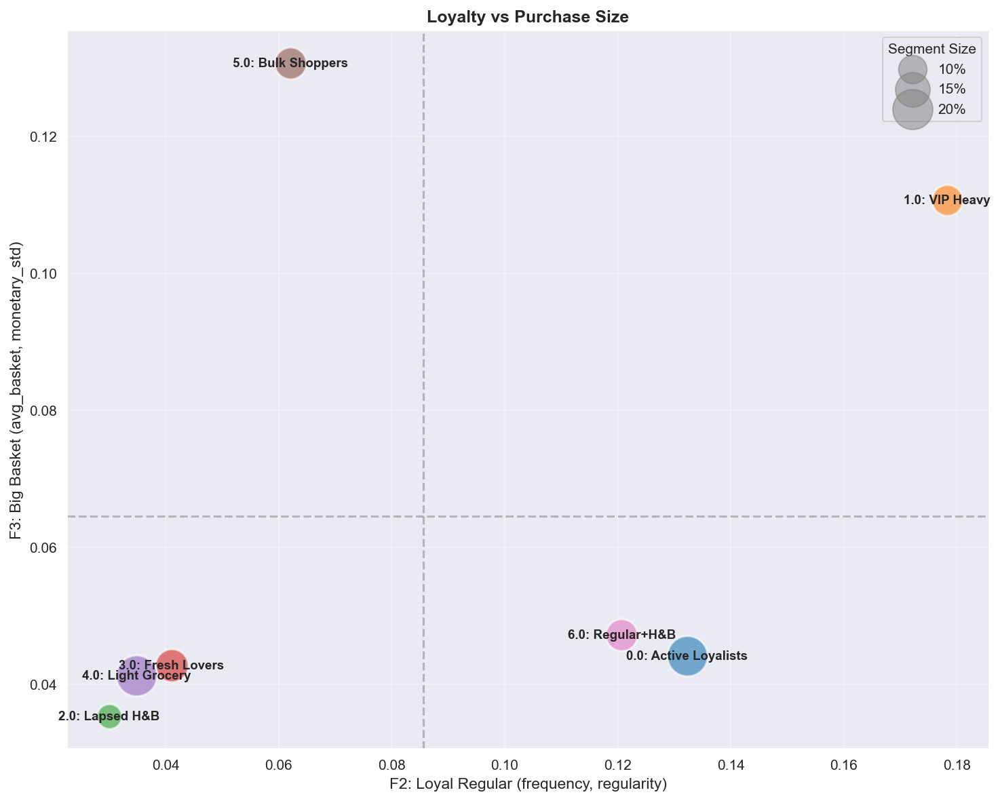

| Quadrant | Segment | Profile | Marketing action |
|----------|---------|---------|------------------|
| **High Loyalty + High Basket** | VIP Heavy | One-stop power shoppers | Focus on retention, personalized recommendations |
| **High Loyalty + Low Basket** | Active Loyalists, Regular+H&B | Frequent small baskets | Cross-sell, expand basket with bundle offers |
| **Low Loyalty + High Basket** | Bulk Shoppers | Irregular bulk buyers | Subscription model, scheduled-delivery incentives |
| **Low Loyalty + Low Basket** | Lapsed, Light Grocery | Minimal engagement | Activation campaigns, habit formation |

---

#### A.4.3 Fresh (F4) vs Health & Beauty (F5)

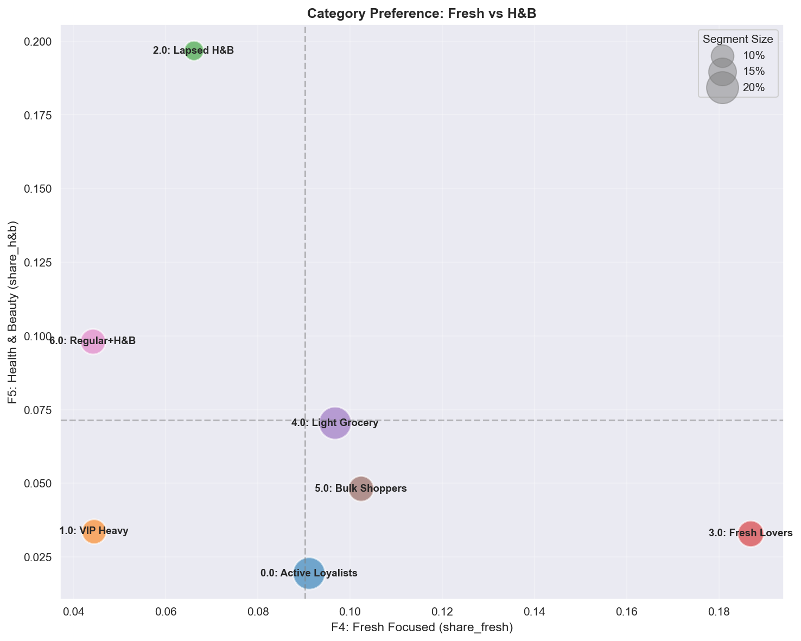

| Quadrant | Segment | Profile | Marketing action |
|----------|---------|---------|------------------|
| **High Fresh + Low H&B** | Fresh Lovers | Cooking/health-focused | Recipe content, farm-to-store storytelling, daily fresh specials |
| **Low Fresh + High H&B** | Lapsed H&B, Regular+H&B | Drugstore needs | H&B sampling, beauty memberships, health subscriptions |
| **Balanced** | VIP Heavy, Active Loyalists | Whole-basket shoppers | Cross-category promotions, one-stop convenience |
| **Low Both** | Light Grocery, Bulk | Essentials-focused | Category-expansion incentives |

---

#### A.4.4 Frequency vs Monetary (RFM Core)

| Quadrant | Segment | Profile | Marketing action |
|----------|---------|---------|------------------|
| **High Freq + High Monetary** | VIP Heavy | Best customers | Protect at all costs, premium treatment |
| **High Freq + Low Monetary** | Active Loyalists | Frequent small spenders | Expand basket size, upsell |
| **Low Freq + High Monetary** | Bulk Shoppers | Warehouse-style | Increase visit frequency, subscription |
| **Low Freq + Low Monetary** | Lapsed, Light Grocery | At-risk/dormant | Segment for win-back ROI evaluation |

---

#### A.4.5 Regularity vs Average Basket Size

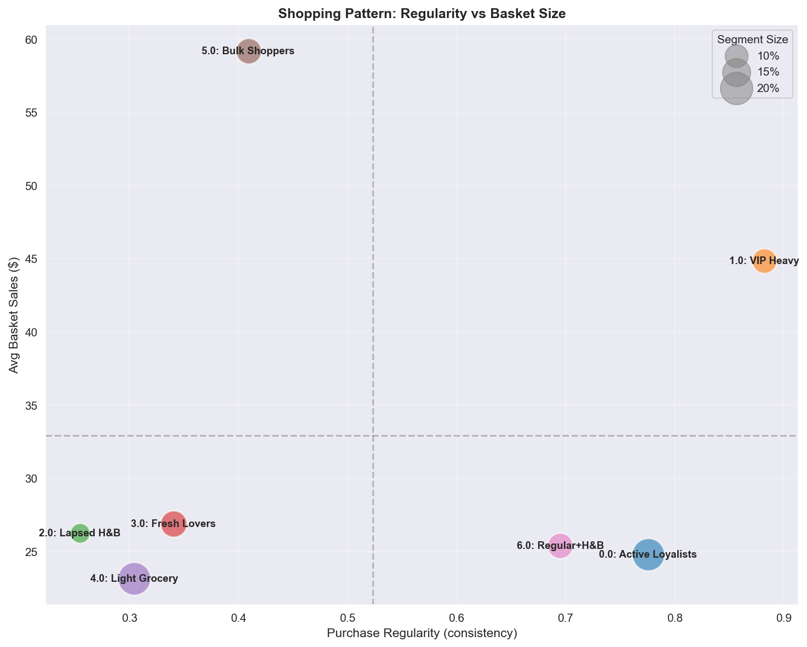

| Quadrant | Segment | Profile | Marketing action |
|----------|---------|---------|------------------|
| **High Regularity + High Basket** | VIP Heavy | Predictable high-value | Maintain rhythm, anticipate needs |
| **High Regularity + Low Basket** | Active Loyalists | Consistent small visits | Shift from top-up to stock-up |
| **Low Regularity + High Basket** | Bulk Shoppers | Sporadic bulk shopping | Regularize via reminders and auto-replenishment |
| **Low Regularity + Low Basket** | Lapsed, Light | Unpredictable low-value | Accept or target re-activation |

---

#### A.4.6 Recency vs Monetary (Lifecycle)

| Quadrant | Segment | Profile | Marketing action |
|----------|---------|---------|------------------|
| **Low Recency + High Monetary** | VIP Heavy, Active Loyalists | Active high-value | Retention, prevent churn signals |
| **Low Recency + Low Monetary** | Fresh Lovers, Light Grocery | Active low-value | Grow value via cross-sell |
| **High Recency + High Monetary** | (rare) | Recently lapsed VIPs | Urgent win-back with premium offers |
| **High Recency + Low Monetary** | Lapsed H&B | Churned low-value | Low-priority win-back, accept churn |

---

#### A.4.7 Discount Rate vs Private Label Ratio

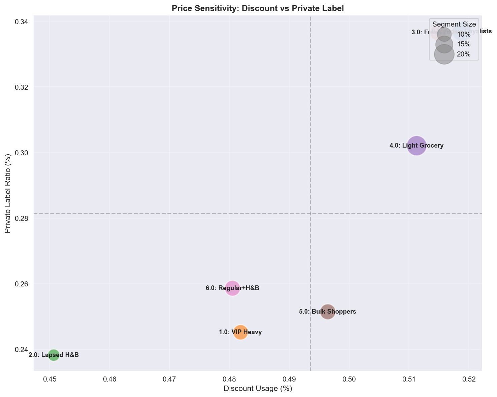

| Quadrant | Segment | Profile | Marketing action |
|----------|---------|---------|------------------|
| **High Discount + High PL** | Active Loyalists | Budget maximizers | PB-focused promotions, value messaging |
| **High Discount + Low PL** | Fresh Lovers | Brand-loyal deal seekers | NB promotions, PB-trial incentives |
| **Low Discount + High PL** | Regular+H&B | Quality-seeking PB fans | Premium PB lines, new PB launches |
| **Low Discount + Low PL** | VIP Heavy, Bulk | Price-indifferent | Avoid discounting, focus on convenience/quality |

---

#### A.4.8 Shopping Variety vs Regularity

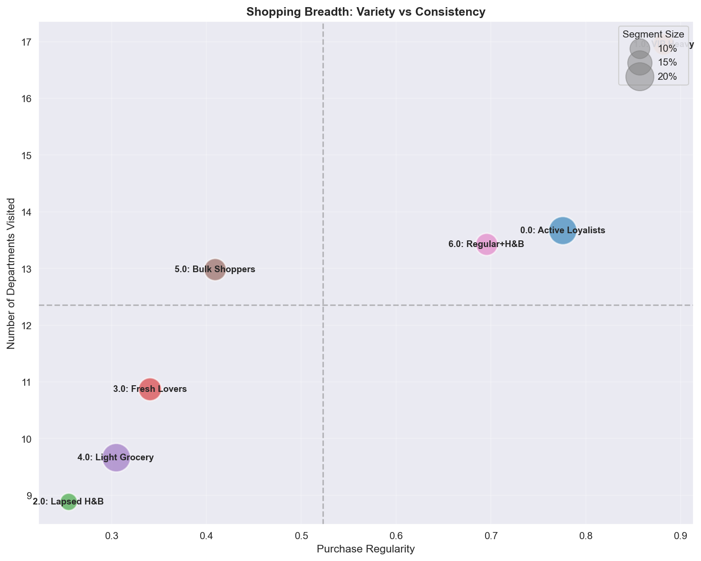

| Quadrant | Segment | Profile | Marketing action |
|----------|---------|---------|------------------|
| **High Variety + High Regularity** | VIP Heavy | Ultimate one-stop shoppers | Full personalization, Category Captain |
| **High Variety + Low Regularity** | Bulk Shoppers | Occasional comprehensive shopping | Convert to a regular cadence |
| **Low Variety + High Regularity** | Fresh Lovers | Category specialists | Deepen the category, expand into adjacencies |
| **Low Variety + Low Regularity** | Lapsed, Light | Narrow and irregular | Expand basket first, then frequency |

---

### A.5 Full Clustering-Metrics Table (clustering_metrics.csv)

Full internal validation metrics for candidate k. Note that **DBI is minimized at k=7 (1.241)**, while the silhouette is maximized at low k (k=3 = 0.271).

| k | Silhouette | Calinski-Harabasz | Davies-Bouldin | Note |
|---|-----------|-------------------|----------------|------|
| 3 | 0.271 | 984.9 | 1.256 | Silhouette max |
| 5 | 0.225 | 794.2 | 1.321 | |
| 6 | 0.207 | 756.3 | 1.342 | DBI worst |
| **7** | 0.219 | 732.0 | **1.241** | **Selected (DBI min + interpretability + stability)** |
| 8 | 0.209 | 700.2 | 1.244 | |

**Interpretation note:** taken in isolation, the silhouette favors low k and Calinski-Harabasz favors the lowest k. We nonetheless adopt k=7 because (1) the DBI minimum is achieved at k=7, (2) the 7 segments map one-to-one onto marketing actions (actionability), and (3) the solution is robust at Bootstrap ARI 0.77 ± 0.11. We record the disagreement between metrics honestly rather than hiding it.

---

## References

### Segmentation Methods
- Lee, D. D., & Seung, H. S. (1999). Learning the parts of objects by non-negative matrix factorization. *Nature*, 401(6755), 788-791.
- Wedel, M., & Kamakura, W. A. (2000). *Market Segmentation: Conceptual and Methodological Foundations*. Springer.
- Punj, G., & Stewart, D. W. (1983). Cluster analysis in marketing research: Review and suggestions for application. *Journal of Marketing Research*, 20(2), 134-148.

### Retail Marketing
- Rossi, P. E., McCulloch, R. E., & Allenby, G. M. (1996). The value of purchase history data in target marketing. *Marketing Science*, 15(4), 321-340.
- Hughes, A. M. (1994). *Strategic Database Marketing*. Probus Publishing.

### Clustering Validation
- Rousseeuw, P. J. (1987). Silhouettes: A graphical aid to the interpretation and validation of cluster analysis. *Journal of Computational and Applied Mathematics*, 20, 53-65.
- Hubert, L., & Arabie, P. (1985). Comparing partitions. *Journal of Classification*, 2(1), 193-218.
