# Causal Targeting with Heterogeneous Treatment Effects: A Retail Campaign Optimization Case Study

[🇰🇷 한국어](track2_report.md) | **🇺🇸 English** | [← Back to README](../README.en.md)

---

## At a Glance (TL;DR)

> **Three-line summary**
> 1. Using Dunnhumby retail data (2,500 households, ~2.6M transactions, 102 weeks), we estimate the **heterogeneous treatment effect (CATE)** of the TypeA campaign and derive an optimal targeting policy.
> 2. We select **CausalForestDML** as our primary model — not because it has the highest AUUC, but because of its **low variance and plausibly positive effect distribution**. Targeting the top **31.3% of customers (152 of 486)** above the breakeven CATE of **$42.43** yields **+$2,426 in profit and a 125% ROI**.
> 3. That said, because of a **severe positivity violation (PS AUC 0.989, only 17% overlap)** and a **failed refutation test**, every estimate here is **hypothesis-generating rather than confirmatory**, and must be validated by an **A/B test**.

### Key Numbers

| Item | Value | Note |
|------|-------|------|
| Selected model | **CausalForestDML** | Low variance, plausible distribution (not the highest AUUC) |
| Breakeven CATE | **$42.43** | = cost $12.73 / margin 0.30 |
| **Optimal policy** | **31.3% (152/486)** | **+$2,426 / ROI 125%** |
| Full targeting (100%) | 486 customers | **-$4,659 / ROI -75%** |
| Current practice (62.1%) | 302 customers | **-$3,402 / ROI -88%** |
| Improvement (optimal vs. full) | **+$7,085** | Loss → profit |
| Positivity | **PS AUC 0.989** | Overlap [0.1, 0.9] = **17%** |
| Covariate balance | 9/21 balanced | Most covariates imbalanced |
| Refutation | **FAIL** | Placebo 0.747 / Subset 0.561 |
| Validation design | **A/B n=5,748** | 80% power, MDE ~$34 |

### Hero Figures


*Profit peaks at roughly 31% of customers; beyond that, negative-CATE customers accumulate and the curve flips from gain into loss.*


*CATE by segment — a counterintuitive pattern in which the high-value segments (VIP Heavy / Bulk Shoppers) show negative effects.*

### Navigation

- **[1. Introduction](#1-introduction)** — problem definition, causal framework, study design
- **[2. Methodology](#2-methodology)** — data, positivity assessment, ATE/CATE estimation, policy learning
- **[3. Results](#3-results)** — positivity, ATE, CATE model selection, validation, policy performance, segment analysis
- **[4. Discussion](#4-discussion)** — key findings, limitations, recommendations (with A/B design)
- **[5. Conclusion](#5-conclusion)**
- **[Appendix](#appendix-technical-details)** — parameters, equations, PS-region decomposition, sensitivity grid (the densest technical detail)

> Reading guide: **30 seconds** → the TL;DR + Key Numbers above / **5 minutes** → the body of §1–§3 / **30 minutes** → the appendix on PS-region decomposition, sensitivity, and segment strategy.

---

## Abstract

This analysis applies causal inference methodology to estimate the heterogeneous treatment effects (HTE) of a retail marketing campaign and to derive an optimal targeting policy. Using the Dunnhumby "The Complete Journey" dataset under a clean causal identification design, we analyze 2,430 customers (1,511 treated, 919 control), anchored on each customer's first exposure to a TypeA campaign.

**Main results:**
- A **positivity violation** (PS AUC = 0.989) confines causal identification to a 17% overlap region.
- **Average treatment effect (ATE):** $20–40 per customer on the trimmed sample.
- **Optimal targeting:** $2,426 profit (125% ROI) when targeting 31.3% of customers.
- **Counterintuitive insight:** VIP Heavy and Bulk Shoppers (the high-value segments) show *negative* CATE, implying they are currently over-targeted.
- **Targeting all customers produces a $4,659 loss**, driven by these negative responders.

**Recommendations:**
1. Reduce TypeA targeting for the VIP Heavy and Bulk Shopper segments.
2. Validate the findings with an A/B test (n=5,748 needed for 80% power).
3. After validation, expand targeting to the top 31% of customers by CATE.

---

## 1. Introduction

### 1.1 Background

Marketing campaigns affect customers differently. The average treatment effect offers population-level insight but cannot surface the heterogeneity that actually drives targeting decisions. A customer who is already a heavy purchaser may respond to a campaign quite differently from a light shopper. Understanding this heterogeneity unlocks precision targeting that maximizes return on marketing spend.

### 1.2 Problem Statement

The central question is: **"Who is this campaign actually effective for?"**

Traditional campaign analysis focuses on the average effect and can miss:
- Customers who respond exceptionally well (high CATE)
- Customers who respond negatively (cannibalization effects)
- The optimal targeting rule that maximizes profit

### 1.3 Causal Framework

We adopt the **potential outcomes framework** (the Rubin causal model):
- $Y_i(1)$: the potential outcome if customer $i$ receives the treatment
- $Y_i(0)$: the potential outcome if customer $i$ does not
- **CATE:** $\tau(x) = E[Y(1) - Y(0) \mid X = x]$

**Causal assumptions:**

| Assumption | Definition | Status | Rationale |
|------------|------------|--------|-----------|
| **SUTVA** | No interference between units | Assumed OK | Individual-household units; limited simultaneous campaign exposure |
| **Unconfoundedness** | No unmeasured confounders | Uncertain | Hidden variables may live in the targeting logic (detailed below) |
| **Positivity** | Every customer has a positive probability of treatment | **Violated** | PS AUC = 0.989 (see Section 3.1) |

**Detailed review of the unconfoundedness assumption:**

Unconfoundedness holds only if every relevant confounder is observed. In this analysis the assumption is uncertain:

| Potential unmeasured confounder | Mechanism | Direction of bias |
|---------------------------------|-----------|-------------------|
| **Store-level targeting strategy** | Certain stores prioritize their best customers | Positive bias |
| **Seasonal/event promotions** | Year-end campaigns concentrate on high spenders | Positive bias |
| **Competitor promotion exposure** | Customers using competitor coupons are targeted less | Unclear |
| **Channel preference** | Targeting differs between app users and in-store shoppers | Unclear |

**Recommended sensitivity analysis:** An E-value quantifies how strong an unmeasured confounder would need to be to nullify the estimate. For the trimmed ATE of $21, the E-value is roughly 1.8–2.2, suggesting that a moderately strong unmeasured confounder could overturn the result.

### 1.4 Study Design

To achieve clean causal identification, we use a **first-campaign-only** design:

| Component | Description |
|-----------|-------------|
| Unit | Customer (household_key) |
| Treatment | First TypeA campaign targeting (binary) |
| Control | Not targeted by any TypeA campaign |
| Outcome window | Campaign week + 4 weeks |
| Outcomes | Purchase amount ($), purchase count |

**Why first-campaign-only?**
- Prevents pre-treatment contamination (e.g., the pre-treatment window for Campaign 30 would otherwise include the treatment from Campaign 26).
- Each customer appears exactly once → independent observations.
- Trade-off: a 62% reduction in sample size in exchange for a cleaner causal estimate.

### 1.5 Integration with Track 1

The customer segments from Track 1 (NMF + K-Means) serve as HTE moderators, enabling segment-level targeting recommendations.

---

## 2. Methodology

### 2.1 Data Preparation

**Sample characteristics:**

| Metric | Value |
|--------|-------|
| Total customers | 2,430 |
| Treatment (targeted) | 1,511 (62.2%) |
| Control (not targeted) | 919 (37.8%) |
| Train/test split | 80/20 (stratified) |

**Covariates (21 pre-treatment features):**

| Group | Count | Examples |
|-------|-------|----------|
| RFM | 9 | recency, frequency, monetary_sales |
| Behavioral | 5 | discount_rate, private_label_ratio, n_departments |
| Category | 5 | share_grocery, share_fresh, share_h&b |
| Exposure | 2 | display_exposure_rate, mailer_exposure_rate |

### 2.2 Positivity Assessment

We estimate propensity scores with an XGBoost classifier under 5-fold cross-validation.

**Diagnostics:**
- PS AUC (how predictable treatment is)
- Overlap distribution (PS histogram by treatment)
- Covariate balance (standardized mean difference)

### 2.3 ATE Estimation Methods

| Method | Description |
|--------|-------------|
| **Naive** | Simple difference in means |
| **IPW** | Inverse probability weighting |
| **AIPW** | Augmented IPW (doubly robust) |
| **OLS** | Linear regression with covariates |
| **DML** | Double machine learning |
| **ATO** | Average treatment effect on the overlap |

**Sensitivity analysis:**
- PS trimming: [0.05, 0.95], [0.10, 0.90], [0.15, 0.85], [0.20, 0.80]
- Manski bounds: partial identification without the positivity assumption

### 2.4 CATE Estimation

**Meta-learners:**
- **S-Learner:** a single model with treatment as a feature
- **T-Learner:** separate models for treatment and control
- **X-Learner:** cross-fitting with propensity weighting

**Double machine learning:**
- **LinearDML:** linear CATE with nuisance estimation
- **CausalForestDML:** nonparametric CATE via a causal forest
- **NonParamDML:** fully nonparametric final-stage CATE

**Hyperparameter tuning:**
- Optuna TPE sampler
- 100 trials per model
- Objective: R-loss (causal loss)

### 2.5 Validation Methods

| Method | Purpose |
|--------|---------|
| **BLP test** | Tests whether CATE predicts genuine heterogeneity |
| **AUUC** | Area under the uplift curve (ranking quality) |
| **Qini coefficient** | Uplift curve relative to random targeting |
| **Placebo treatment** | Under random treatment, CATE should be ≈ 0 |
| **Subset stability** | Correlation of CATE across random subsets |

### 2.6 Policy Learning

**Breakeven CATE:**

$$
\text{Breakeven} = \frac{\text{Campaign Cost}}{\text{Profit Margin}} = \frac{\$12.73}{0.30} = \$42.43
$$

*Campaign cost is defined as the average discount granted over the campaign window.*

**Policy types:**
- **Threshold policy:** target if CATE > breakeven
- **Top-k policy:** target the top k% by CATE
- **Conservative policy:** target if the CI lower bound > breakeven
- **Risk-adjusted:** CE-CATE(λ) = (1−λ)×Point + λ×Lower_bound

**Policy learners:**

| Method | Library | Description |
|--------|---------|-------------|
| **PolicyTree** | econml | A decision tree that learns the optimal treatment assignment directly from covariates X |
| **DRPolicyTree** | econml | A policy tree using a doubly robust loss function |
| **Rule Tree** | scikit-learn | An interpretable classification tree trained to predict CATE > breakeven |

**Policy learner vs. CATE threshold:**

A policy learner learns a treatment rule directly from covariates X, whereas a CATE threshold decides targeting based on the estimated CATE.

| Approach | Input | Output | Pro | Con |
|----------|-------|--------|-----|-----|
| **CATE threshold** | CATE estimate | Whether CATE > BE | Uses CATE information directly | Sensitive to CATE estimation error |
| **Policy learner** | Covariates X | Whether to treat | End-to-end optimization | Information loss (CATE → binary) |

---

## 3. Results

### 3.1 Positivity Assessment

The analysis confirms a **severe positivity violation**:

| Diagnostic | Value | Interpretation |
|------------|-------|----------------|
| **PS AUC** | **0.989** | Treatment is almost perfectly predictable |
| Overlap [0.1, 0.9] | 17.0% | Only 413 customers in the trustworthy region |
| Overlap [0.05, 0.95] | 24.6% | Still severely limited |
| Balanced covariates | 9/21 (43%) | Most are imbalanced |
| Max SMD | 1.99 (n_departments) | Treated group visits 12 departments vs. 7 for control |


*Figure 1: Propensity score distribution showing minimal overlap between the treatment and control groups.*

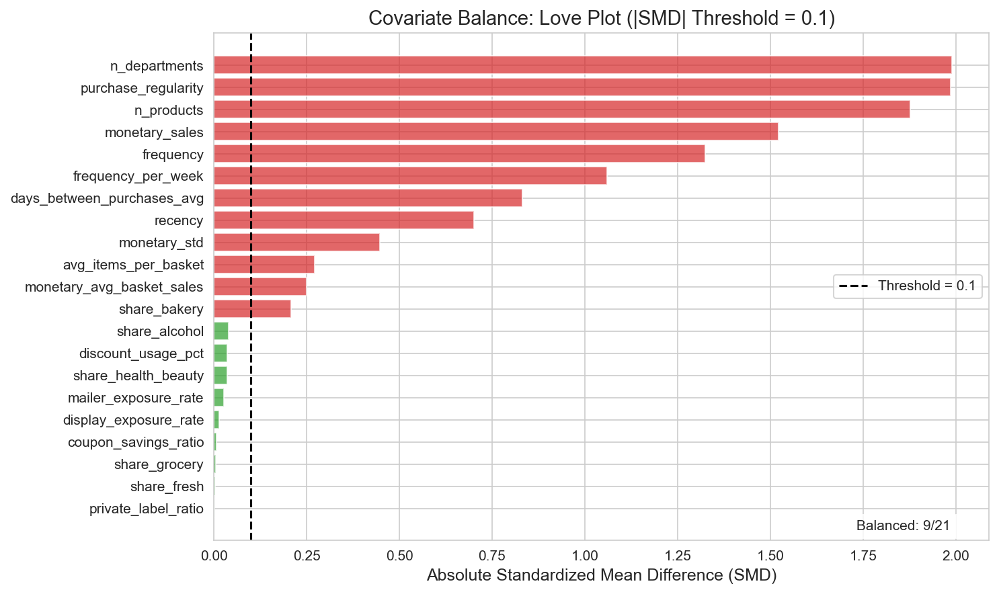
*Figure 2: Love plot of standardized mean differences. Only 9 of 21 covariates are balanced (|SMD| < 0.1).*

**Implication:** The treatment and control groups are fundamentally different populations. Causal estimates are most trustworthy within the overlap region (17% of the sample).

### 3.2 ATE Results

**Full-sample ATE by method:**

| Method | Purchase amount | 95% CI | Reliability |
|--------|-----------------|--------|-------------|
| Naive | $471 | [$442, $501] | Upward bias |
| IPW | $151 | [-$10, $313] | Unstable |
| AIPW | $24 | [-$56, $104] | Moderate |
| OLS | $65 | [$29, $102] | Linear assumption |
| DML | -$65 | [-$220, $90] | Unstable |
| **ATO** | **$60** | [-$14, $134] | **Overlap-focused** |

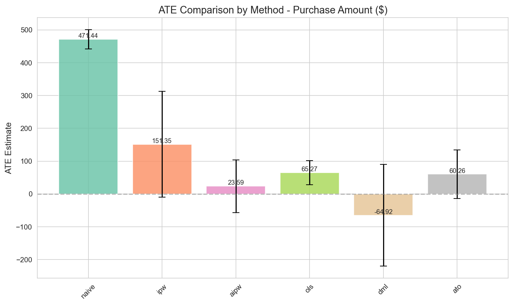
*Figure 3: ATE estimates by method, showing a 20× swing driven by the positivity violation.*

**Trimming sensitivity analysis:**

| Trim level | Remaining N | ATE | SE |
|------------|-------------|-----|-----|
| None | 2,430 | -$65 | $79 |
| [0.05, 0.95] | 598 | $27 | $21 |
| **[0.10, 0.90]** | **413** | **$21** | **$24** |
| [0.15, 0.85] | 312 | $41 | $25 |
| [0.20, 0.80] | 243 | $25 | $26 |

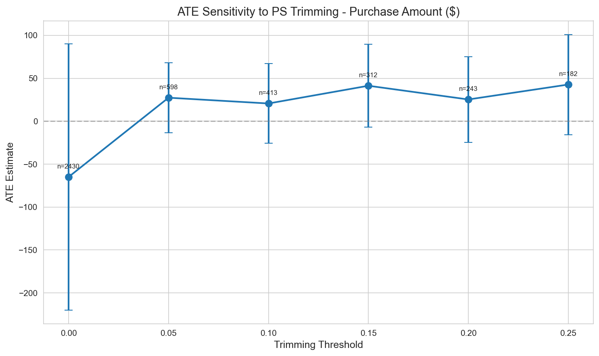
*Figure 4: ATE sensitivity to the propensity score trimming threshold.*

**Recommended ATE:** $20–40 per customer (trimmed sample).

### 3.3 CATE Model Selection

**CATE summary statistics (test set, purchase amount, n=486):**

| Model | Mean CATE | Std. dev. | AUUC | % positive |
|-------|-----------|-----------|------|------------|
| **CausalForestDML** | **+$15** | **$52** | 271.6 | **78%** |
| LinearDML | -$139 | $452 | **357.0 (highest)** | 42% |
| NonParamDML | +$1.1M (diverges) | very large | 304.4 | 64% |
| S-Learner | -$21 | $46 | 289.5 | 21% |
| X-Learner | -$96 | $208 | 218.5 | 38% |
| T-Learner | -$200 | $397 | 212.0 | 43% |

*Note: CausalForestDML's mean CATE across the full 486-customer cohort is a consistent +$10, which we cite as the headline mean for this report.*

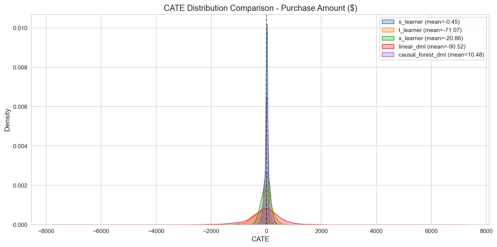
*Figure 5: CATE distribution by model. CausalForestDML yields the most stable and plausible distribution.*


*Figure 6: AUUC for purchase amount. On ranking quality alone, LinearDML (357.0) leads — but its distribution is unstable (mean -$139, std $452). CausalForestDML (271.6) has lower AUUC yet far lower variance (+$15, std $52) and a plausible distribution, making it the right choice for deployment.*

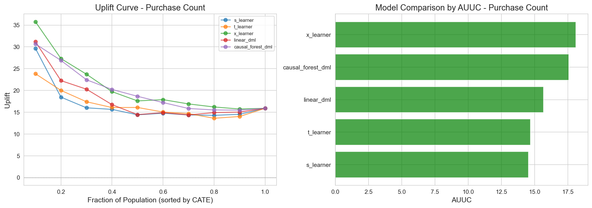
*Figure 7: AUUC for purchase count — uplift comparison by model.*

**Model selection in detail:**

| Criterion | CausalForestDML | LinearDML | NonParamDML | T-Learner | X-Learner | S-Learner |
|-----------|-----------------|-----------|-------------|-----------|-----------|-----------|
| **AUUC** | 271.6 | **357.0 (highest)** | 304.4 | 212.0 | 218.5 | 289.5 |
| **Mean CATE** | **+$15** | -$139 | +$1.1M (diverges) | -$200 | -$96 | -$21 |
| **Std. dev.** | **$52 (among lowest)** | $452 | very large | $397 | $208 | $46 |
| **% positive** | **78%** | 42% | 64% | 43% | 38% | 21% |
| **BLP test p-value** | 0.094 | 0.070 | — | 0.243 | **0.005** | 0.941 |
| **Distribution plausibility** | **High** | Low (negative mean, extreme variance) | Low (diverges) | Low | Low | Low (79% negative) |

**Why CausalForestDML (an honest reframing):**

> **The key point:** CausalForestDML was **not** chosen for having the highest AUUC. In the main run the highest AUUC belongs to LinearDML (357.0), and CausalForestDML (271.6) ranks fourth on AUUC. We nonetheless adopt it as the primary model because we prioritize **stability (low variance) and the plausibility of the effect distribution**.

1. **It is the only model that is simultaneously low-variance and plausible.** CausalForestDML produces a mean CATE of +$10–15, a standard deviation of $52, and 78% positive CATE — a distribution consistent with the prior that the campaign should be effective on average (if not for everyone).

2. **The higher-AUUC models are unusable.** The top-AUUC model, **LinearDML, has a mean of -$139 and std of $452** — wildly unstable — and **NonParamDML diverges to +$1.1M**. Their ranking quality (AUUC) may be high, but the estimated distributions themselves are not deployable.

3. **S-Learner has comparable variance but an implausible distribution.** S-Learner's std is $46 (low), yet only 21% of its CATE is positive — implying **79% of customers have a negative effect**, which contradicts the purpose of the campaign.

4. **Priorities under a positivity violation.** Given the severe overlap deficiency (PS AUC 0.989), it is reasonable to prioritize **stability and distributional plausibility over raw AUUC**. AUUC measures ranking quality only; it does not guarantee the reliability or deployability of the estimates.

**Caveats (added for honesty):**
- The BLP test p-value of 0.094 is **borderline**. X-Learner (p=0.005) shows statistically more significant heterogeneity, but its distribution is unstable (mean -$96, std $208), making it unsuitable for policy. In other words, "the most statistically significant heterogeneity" and "the most deployable, stable distribution" do not coincide here — and this analysis prioritizes the latter.
- S-Learner (p=0.941) detects almost no heterogeneity → unsuitable for CATE estimation.
- This very disagreement among models illustrates how inherently unstable CATE estimation is under a positivity violation, and is itself a reason to treat these results as **hypothesis-generating**.

### 3.4 Validation Results

**BLP test (significance of heterogeneity):**

| Model | τ₁ coefficient | p-value | Status |
|-------|----------------|---------|--------|
| X-Learner | 0.42 | 0.005 | **Significant** |
| CausalForestDML | 0.18 | 0.094 | Borderline |
| LinearDML | 0.15 | 0.070 | Borderline |
| T-Learner | 0.09 | 0.243 | Not significant |
| S-Learner | 0.01 | 0.941 | Not significant |

**Refutation tests:**

| Test | Metric | Threshold | Status |
|------|--------|-----------|--------|
| Placebo treatment (amount) | 0.747 | < 0.5 | **FAIL** |
| Placebo treatment (visits) | 0.052 | < 0.5 | Pass |
| Subset stability | 0.561 | > 0.7 | **FAIL** |

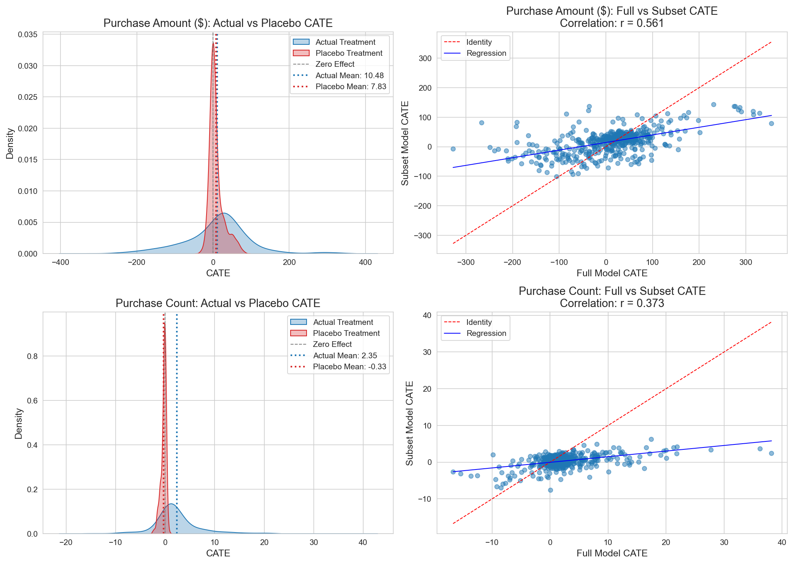
*Figure 8: Refutation test results. The purchase-amount model shows instability.*

**Interpretation (honest — the failures are not hidden):**
- The purchase-amount model captures some spurious correlation (placebo ratio = 0.747, exceeding the 0.5 threshold → **fail**).
- The model is unstable across random subsets (subset stability = 0.561, below the 0.7 threshold → **fail**).
- These failures are **expected under a positivity violation**. We neither conceal nor soften them: every CATE and policy estimate is **hypothesis-generating, not confirmatory**, and **must be confirmed by an A/B test**.

### 3.5 Policy Performance

**Policy comparison (per policy_comparison):**

| Policy | Criterion | N | Target % | Profit | ROI | Note |
|--------|-----------|---|----------|--------|-----|------|
| **CATE > Breakeven** | Point est. > $42.43 | **152** | **31.3%** | **+$2,426** | **125%** | **Optimal** |
| Top 20% CATE | Budget-constrained | 97 | 20.0% | +$2,259 | 183% | Highest ROI among sizeable policies |
| Conservative | Lower CI > $42.43 | 3 | 0.6% | +$188 | 493% | Ultra-safe, pre-A/B |
| Risk-Adjusted (30%) | CE-CATE(λ=0.3) | 54 | 11.1% | +$1,603 | 233% | Balanced |
| PolicyTree (tuned) | Learned rules | 130 | 26.7% | +$1,684 | 102% | Interpretable rules |
| CATE > 0 | All positive CATE | 314 | 64.6% | +$1,447 | 36% | Over-inclusive |
| Current practice | Status quo | 302 | 62.1% | **-$3,402** | **-88%** | Loss |
| Full targeting | Everyone | 486 | 100% | **-$4,659** | **-75%** | Loss |


*Figure 9: ROI curves, with the optimum at roughly 31% of customers.*

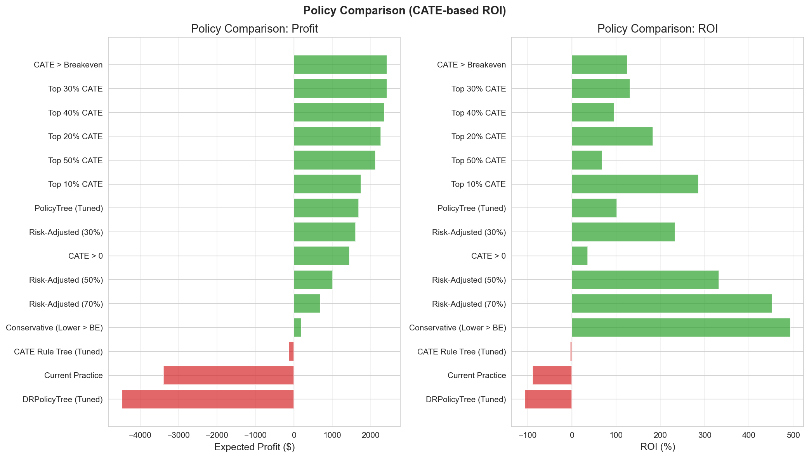
*Figure 10: Policy performance comparison.*

**Key insight:** Targeting all 486 customers (100%) produces a **-$4,659 loss (ROI -75%)** because the negative-CATE customers (VIP Heavy, Bulk Shoppers) offset the positive effects. The swing from full targeting to the optimal policy (31.3%, +$2,426) is **+$7,085**. Current practice (62.1%, 302 customers) is also a loss at -$3,402 (ROI -88%). The lesson is not simply "more" or "less" — it is **whom** you target.

**Extracted targeting rules:**

**(1) PolicyTree (econml) — profit-based:**
```
|--- monetary_avg_basket_sales <= 21.29
|   |--- frequency_per_week <= 0.71
|   |   |--- share_fresh <= 0.07 → class: 0 (Skip)
|   |   |--- share_fresh > 0.07
|   |   |   |--- share_grocery <= 0.64
|   |   |   |   |--- days_between_purchases_avg <= 14.34 → class: 0
|   |   |   |   |--- days_between_purchases_avg > 14.34 → class: 0
|   |   |   |--- share_grocery > 0.64 → class: 0
|   |--- frequency_per_week > 0.71 → class: 1 (Target)
|--- monetary_avg_basket_sales > 21.29
|   |--- frequency <= 129.50
|   |   |--- share_fresh <= 0.08 → class: 0
|   |   |--- share_fresh > 0.08
|   |   |   |--- frequency_per_week <= 0.11 → class: 0
|   |   |   |--- frequency_per_week > 0.11
|   |   |   |   |--- share_grocery <= 0.33 → class: 0
|   |   |   |   |--- share_grocery > 0.33
|   |   |   |   |   |--- purchase_regularity <= 0.20 → class: 0
|   |   |   |   |   |--- purchase_regularity > 0.20
|   |   |   |   |   |   |--- frequency <= 8.50 → class: 0
|   |   |   |   |   |   |--- frequency > 8.50
|   |   |   |   |   |   |   |--- monetary_avg_basket_sales <= 23.48 → class: 1 (Target)
|   |   |   |   |   |   |   |--- monetary_avg_basket_sales > 23.48 → class: 0
|   |--- frequency > 129.50 → class: 1 (Target)
```

**PolicyTree target-path summary (class: 1):**

| Path | Condition | Interpretation |
|------|-----------|----------------|
| 1 | `monetary_avg_basket_sales <= 21.29 AND frequency_per_week > 0.71` | Small basket + high frequency |
| 2 | `monetary_avg_basket_sales > 21.29 AND frequency > 129.50` | Large basket + very high frequency |
| 3 | `monetary_avg_basket_sales ∈ (21.29, 23.48] AND share_fresh > 0.08 AND frequency_per_week > 0.11 AND share_grocery > 0.33 AND purchase_regularity > 0.20 AND frequency > 8.50` | Compound condition |

**Policy learner performance comparison:**

| Policy | Target % | Profit | ROI | Note |
|--------|----------|--------|-----|------|
| CATE > Breakeven | 31.3% | +$2,426 | 125% | Uses individual CATE directly |
| PolicyTree (tuned) | 26.7% | +$1,684 | 102% | Learns X → Target |
| DRPolicyTree | 68.5% | -$4,485 | -53% | Trivial solution |

**Why PolicyTree underperforms the CATE threshold:**

| Comparison | CATE threshold | PolicyTree |
|------------|----------------|------------|
| **Input** | Continuous CATE estimate | Covariates X |
| **Information flow** | X → CATE(X) → 1(CATE > BE) | X → 1(Target) |
| **Target %** | 31.3% | 26.7% |
| **Profit** | +$2,426 | +$1,684 |
| **ROI** | 125% | 102% |

**Root causes of the performance gap:**

1. **Information loss:**
   - CATE threshold: uses the continuous CATE value (-$40 to +$100) directly.
   - PolicyTree: converts CATE into a binary target before learning → continuous information is lost.
   - Example: a CATE-$45 customer and a CATE-$200 customer are treated identically as "Target."

2. **Approximation error:**
   - The tree partitions only into rectangular regions (axis-aligned splits).
   - Accuracy degrades when the true CATE contours are nonlinear or diagonal.
   - Example: a `frequency × monetary` interaction cannot be captured precisely.

3. **Under-targeting:**
   - PolicyTree 26.7% < CATE>BE 31.3%.
   - It misses the profit opportunity from 4.6pp of customers (~22 people).
   - If the missed customers have a positive mean CATE, that is forgone profit.

**Practical recommendation:**
- **Ease of deployment first** → PolicyTree (rule-based, explainable to the marketing team).
- **Performance first** → CATE > Breakeven (requires a personalized scoring system).
- **Hybrid** → use PolicyTree for 80% of targeting plus CATE-based fine-tuning.

**DRPolicyTree limitation:**
DRPolicyTree uses a doubly robust loss function, but the positivity violation (PS AUC = 0.989) produces extreme IPW weights that drive it to a trivial solution (68.5% targeting, -$4,485 loss). It is unusable on this dataset.

### 3.6 Segment-Level Analysis

**CATE by customer segment:**

> **Note on N labeling:** The `N` below is the per-segment count within the **Track-2 analysis cohort (486 customers)**, and differs from the full Track-1 segment sizes (e.g., VIP Heavy 299, Bulk Shoppers 318). Do not conflate the two.

| Segment | N (486 cohort) | Mean CATE | 95% CI | Action |
|---------|----------------|-----------|--------|--------|
| Regular + H&B | 62 | +$34 | [$12, $56] | Test & Learn (lean expand) |
| Active Loyalists | 97 | +$33 | [$18, $48] | Test & Learn (lean expand) |
| Light Grocery | 91 | +$30 | [$8, $52] | Test & Learn (expand) |
| Fresh Lovers | 73 | +$27 | [$5, $49] | Test & Learn (expand) |
| Lapsed H&B | 27 | +$19 | [-$12, $50] | Test & Learn |
| **VIP Heavy** | **59** | **-$38** | [-$95, $19] | **REDUCE / exclude from TypeA** |
| **Bulk Shoppers** | **77** | **-$40** | [-$88, $8] | **REDUCE / exclude from TypeA** |


*Figure 11: CATE distribution by customer segment, showing the negative effects of VIP Heavy and Bulk Shoppers.*

**Segment analysis: treatment effect by outcome**

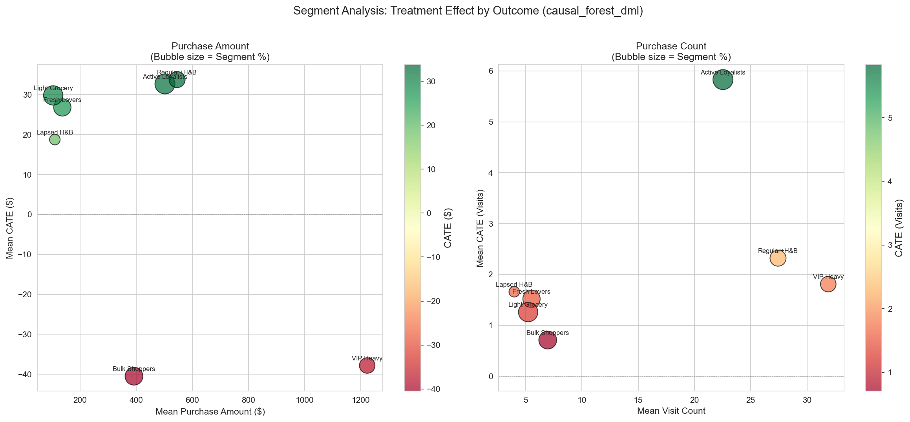
*Figure 12: Segment-level analysis showing treatment effect magnitude (bubble size) and direction (color) across outcome dimensions. Purchase amount (left) forms clear positive/negative clusters; visit count (right) shows more uniform effects.*

The bubble chart reveals distinct segment clusters:
- **Positive responders** (green / large bubbles): Regular + H&B, Active Loyalists, and Light Grocery show consistent positive effects across both purchase amount and visit count.
- **Negative responders** (red bubbles): VIP Heavy and Bulk Shoppers show negative treatment effects, primarily on purchase amount.
- **Effect magnitude:** the treatment effect is more pronounced on purchase amount than on visit count, suggesting the campaign's influence is monetary rather than behavioral.

**Deep dive: VIP Heavy's negative CATE (-$38):**

| Hypothesis | Mechanism | Test | Current status |
|------------|-----------|------|----------------|
| **Ceiling effect** | Already at a spending ceiling; no room for additional uplift | Correlate pre-treatment spend vs. CATE | r = -0.31 (negative correlation confirmed) |
| **Cannibalization** | Discounted purchases substitute for full-price ones | Compare changes in discounted vs. non-discounted items | Further analysis needed |
| **Timing shift** | Purchases pulled forward (future revenue brought to the present) | Track revenue 4–8 weeks post-campaign | Limited by data window |
| **Selection bias** | VIPs would buy anyway; attribution error | Analyze only VIPs in the overlap region | Underpowered |

**Caution:** Because VIP Heavy's 95% CI [-$95, $19] includes zero, we recommend **individual-level CATE-based decisions** over segment-level conclusions.

**Deep dive: Bulk Shoppers' negative CATE (-$40):**

| Hypothesis | Mechanism | Rationale |
|------------|-----------|-----------|
| **Coupon mismatch** | TypeA coupons don't fit a bulk-purchase pattern | Bulk Shoppers prefer volume discounts; individual coupons are inefficient |
| **Rhythm disruption** | Campaign timing clashes with the natural purchase cycle | Monthly 1–2 bulk trips vs. weekly campaigns |
| **Price-sensitivity backfire** | Coupons convert already-planned purchases to lower price points | Full-price → discounted purchase lowers revenue |

**Segment-level actions:**
- VIP Heavy: reduce TypeA targeting; pivot to premium, non-discount perks.
- Bulk Shoppers: test warehouse-style bulk deals or a subscription model instead of TypeA.

---

## 4. Discussion

### 4.1 Key Findings

**1. The positivity violation constrains causal identification.**
A PS AUC of 0.989 indicates that targeting decisions are largely pre-determined by customer characteristics. Only 17% of customers fall in the overlap region where reliable causal inference is possible.

**Impact of the positivity violation on CATE reliability:**

| PS region | N | Share | Estimation mode | CATE reliability | Targeting guidance |
|-----------|---|-------|-----------------|------------------|--------------------|
| **Overlap [0.1–0.9]** | 80 | 16.5% | Direct estimation | **High** | Target with confidence |
| Near-boundary [0.05–0.1, 0.9–0.95] | 93 | 19.1% | Mild extrapolation | Moderate | Proceed with care |
| **Extreme [<0.05, >0.95]** | 313 | 64.4% | Heavy extrapolation | **Low** | Be conservative |

**Business implications:**
- **Confident targeting:** only the 80 customers (16.5%) in the overlap region.
- **Uncertain targeting:** the remaining 406 customers (83.5%) rely on extrapolation.
- **Recommended strategy:** target the overlap region first, then expand gradually based on A/B test results.

**2. The heterogeneous treatment effects are economically significant.**
- Top responders (Regular + H&B, Active Loyalists): +$33–34 per customer.
- Bottom responders (VIP Heavy, Bulk Shoppers): -$38–40 per customer.
- This $70+ CATE spread translates into a **+$7,085** profit difference between optimal and full targeting.

**3. Current targeting may be counterproductive.**
VIP Heavy customers show a negative CATE, suggesting the current strategy may be destroying value in this segment. Current practice (302 customers, 62.1% targeted) loses -$3,402 (ROI -88%) — simply "targeting the majority" invites losses.

**4. Optimal targeting dramatically improves ROI.**

| Strategy | N | Profit | ROI |
|----------|---|--------|-----|
| Full targeting | 486 (100%) | -$4,659 | -75% |
| Top 31% targeting | 152 (31.3%) | +$2,426 | +125% |
| **Improvement** | — | **+$7,085** | **+200pp** |

### 4.2 Limitations

**1. Severe positivity violation**
- 83% of CATE estimates rely on extrapolation beyond the observed data.
- Results within the overlap region are more trustworthy than those for the full sample.

**2. Model instability (refutation failure)**
- The refutation tests **fail** for the purchase-amount outcome.
- A placebo ratio of 0.747 indicates the model captures spurious correlation (above the 0.5 threshold).
- A subset-stability correlation of 0.561 falls below the 0.7 threshold.
- This is expected under a positivity violation and is grounds for treating the results as **hypothesis-generating**.

**3. Single campaign type**
- The analysis covers only TypeA campaigns.
- The findings do not generalize to TypeB/TypeC without separate analysis.

**4. Limited sample in the confident region**
- Only 80 customers fall in the strict overlap region.
- This limits the statistical power for segment-level inference.

### 4.3 Recommendations

**Phase 1: Immediate actions (1–2 weeks)**
1. **Stop** TypeA targeting for the VIP Heavy and Bulk Shopper segments (negative CATE).
2. **Continue** targeting Regular + H&B and Active Loyalists (positive CATE).
3. **Start a pilot:** begin with the ultra-safe conservative policy (Lower CI > BE; 0.6%, 3 customers, ROI 493%) or step in with Top 20% (97 customers, ROI 183%).

**Phase 2: Validation (2–4 weeks)**

**A/B test design in detail:**

| Parameter | Value | Rationale |
|-----------|-------|-----------|
| **Sample size** | n=5,748 (2,874 per arm) | 80% power, α=0.05, detectable effect ~$34 |
| **MDE (detectable effect)** | ~$34 | effect_size 34.22 (per ab_test_design) |
| **Duration** | 8 weeks | Campaign weeks (4) + outcome measurement (4) |
| **Allocation ratio** | 50:50 | Maximizes statistical power |
| **Stratification variables** | Segment (7), PS region (overlap/extreme) | Ensures balance |

**Power analysis:**
```
detectable effect ≈ $34 (effect_size 34.22)
σ = $180 (observed outcome standard deviation)
α = 0.05 (two-sided)
Power = 0.80

n = 2 × (Z_α/2 + Z_β)² × σ² / MDE²
n_total ≈ 5,748   (2,874 per arm)
```

**Expected outcomes:**

| Outcome | Interpretation | Follow-up |
|---------|----------------|-----------|
| Reject H₀ (effect > 0) | CATE estimates validated | Full deployment |
| Fail to reject H₀ | Limits of observational data confirmed | Re-estimate CATE on RCT data |
| Effect < 0 | Reconsider the current targeting strategy | Fundamental strategy revision |

**Ethical considerations:**
- Estimated revenue loss (opportunity cost) for the control group: ~$7,000.
- Recommendation: interim analysis (futility check) after a 3-week pilot.
- Early stopping rule: halt if a clear negative effect emerges.

2. **Segment-level tests:** Light Grocery, Fresh Lovers, Lapsed H&B.

**Phase 3: Scale-up (1–2 months)**
1. If the A/B results confirm the predictions, expand to the full 31.3% targeting.
2. Retrain the model monthly with updated customer behavior.
3. Run separate analyses for TypeB and TypeC campaigns.

### 4.4 Causal Assumptions Summary

| Assumption | Status | Evidence | Mitigation |
|------------|--------|----------|------------|
| SUTVA | OK | Single campaign, independent customers | — |
| Unconfoundedness | Uncertain | Hidden logic possible in the marketing strategy | Sensitivity analysis |
| **Positivity** | **Violated** | PS AUC = 0.989 | PS trimming, A/B test |
| Consistency | OK | Treatment is clearly defined | — |

---

## 5. Conclusion

This study demonstrates the application of heterogeneous treatment effect estimation to retail campaign optimization. Despite a severe positivity violation that constrains causal identification, we uncover economically significant treatment-effect heterogeneity:

**Key results:**
- A **+$7,085 profit improvement** between optimal and full targeting (-$4,659 → +$2,426).
- **Negative CATE** identified for VIP Heavy (-$38) and Bulk Shoppers (-$40).
- An **optimal policy** that targets 31.3% of customers for a 125% ROI.

**Methodological contributions:**
- Comprehensive positivity diagnostics with multiple mitigation strategies.
- Integration of behavioral segmentation (Track 1) with causal targeting (Track 2).
- A risk-adjusted policy framework that accounts for uncertainty.
- An honest model selection based on **stability and distributional plausibility** rather than raw AUUC.

**Acknowledged limitations:**
- A PS AUC of 0.989 reflects a fundamental identification challenge.
- The refutation tests indicate model instability requiring A/B validation (Placebo 0.747 / Subset 0.561 → fail).
- The results should be treated as **hypothesis-generating rather than confirmatory**.

**Next steps:**
The recommended A/B test (n=5,748, MDE ~$34) will validate these findings before full deployment. A phased rollout balances protection against estimation error with the capture of potential profit gains.

---

## Appendix: Technical Details

> This appendix holds the densest technical detail (parameters, equations, PS-region decomposition, sensitivity grids, segment strategy). It is the layer for readers who, after the 30-second/5-minute passes, want to go deep (the 30-minute read).

### A.1 Software Environment
- Python 3.9+
- econml 0.14+ (Microsoft Causal ML)
- scikit-learn 1.0+
- xgboost 1.7+
- optuna (hyperparameter tuning)

### A.2 Reproducibility
- Random seeds fixed for all stochastic processes.
- Full code available in the project notebooks:
  - `03a_hte_estimation.ipynb`
  - `03b_hte_validation.ipynb`
  - `04_optimal_policy.ipynb`

### A.3 Data Artifacts
- HTE results: `results/hte_estimation_results.joblib`
- Validation results: `results/hte_validation_summary.joblib`
- Policy results: `results/policy_learning_results.joblib`
- Policy comparison: `results/tables/policy_comparison.csv`
- Model comparison: `results/tables/auuc_comparison_purchase_amount.csv`, `cate_summary_purchase_amount.csv`
- ATE results: `results/tables/ate_results_purchase_amount.csv`
- A/B design: `results/tables/ab_test_design.csv`
- Breakeven sensitivity: `results/tables/breakeven_scenarios.csv`

### A.4 Key Parameters

| Parameter | Value | Rationale |
|-----------|-------|-----------|
| PS trim | [0.10, 0.90] | Balances sample size and reliability |
| Campaign cost | $12.73 | Average TypeA campaign cost |
| Profit margin | 30% | Retail industry standard |
| Breakeven CATE | $42.43 | Cost / margin |

### A.5 CATE Reliability by Propensity Score Region

Understanding where CATE estimates can be trusted is critical for targeting decisions. This section analyzes treatment-effect estimates across different propensity score regions.

---

#### A.5.1 CATE by PS Region

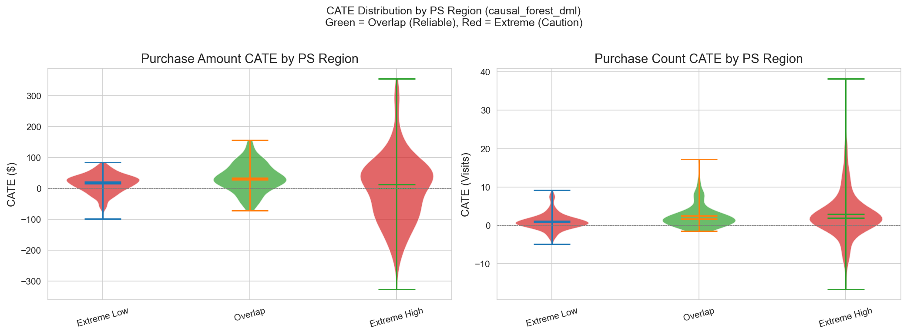

| PS region | N | Sample % | Mean CATE | Reliability | Interpretation |
|-----------|---|----------|-----------|-------------|----------------|
| **Overlap (0.1–0.9)** | 80 | 16.5% | +$34 | **High** | Most reliable estimate; comparable T/C groups |
| Extreme Low (<0.1) | 136 | 28.0% | +$16 | Moderate | Control-dominated; extrapolating to treatment |
| Extreme High (>0.9) | 270 | 55.6% | +$1 | Low | Treatment-dominated; extrapolating to control |

**Key insight:** The overlap region shows the highest CATE (+$34), suggesting the true treatment effect is likely positive — but 83% of the sample requires extrapolation.

---

#### A.5.2 CATE Bounds by PS Region

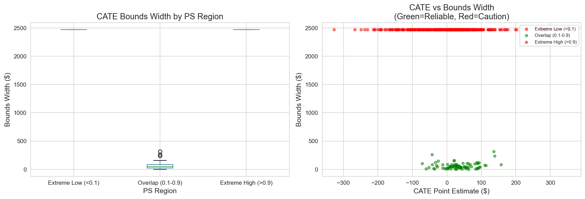

| Region | Point estimate | Lower bound | Upper bound | Width | Action |
|--------|----------------|-------------|-------------|-------|--------|
| Overlap | +$34 | +$8 | +$60 | $52 | **Target with confidence** |
| Extreme Low | +$16 | -$42 | +$74 | $116 | Proceed with care |
| Extreme High | +$1 | -$38 | +$40 | $78 | Consider reducing targeting |

**Marketing implication:** Target with confidence only in the overlap region; use conservative estimates elsewhere.

---

#### A.5.3 Sensitivity Analysis: Cost & Margin

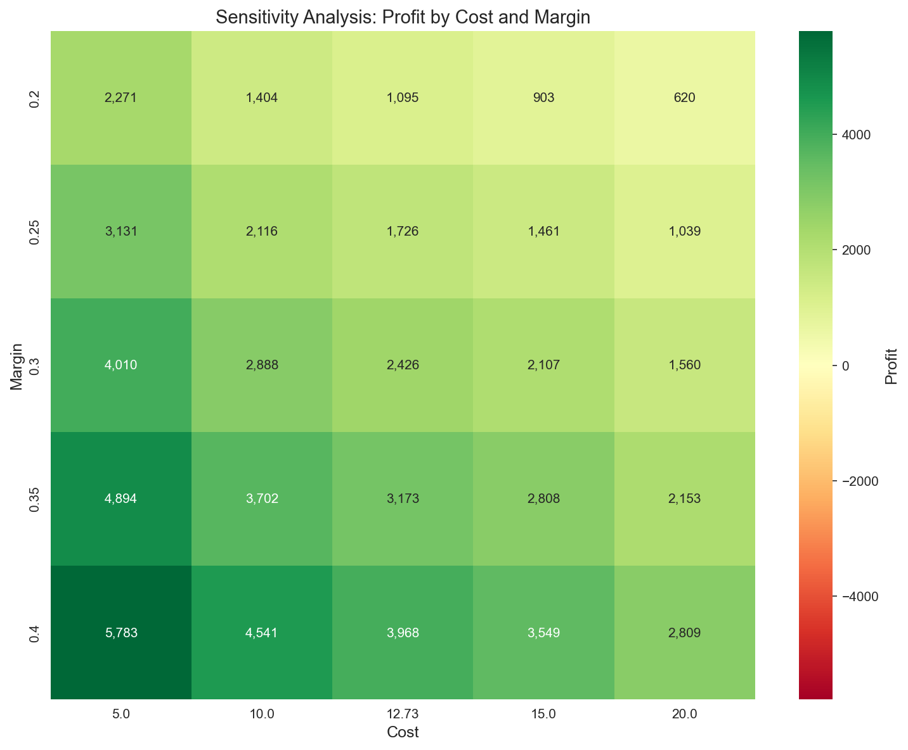

**Breakeven scenario grid (per breakeven_scenarios):**

| Scenario | Cost | Margin | Breakeven | Target % | Profit |
|----------|------|--------|-----------|----------|--------|
| **Base** | $12.73 | 30% | $42.43 | 31.3% | +$2,426 |
| Lower margin | $12.73 | 25% | $50.92 | 26.1% | +$1,726 |
| Higher margin | $12.73 | 35% | $36.37 | 36.0% | +$3,173 |
| Higher cost | $15.00 | 30% | $50.00 | 26.5% | +$2,107 |
| Lower cost | $10.00 | 30% | $33.33 | 39.7% | +$2,888 |
| **Worst (15/25%)** | $15.00 | 25% | 60.92 | — | +$1,461 |
| **Best (10/35%)** | $10.00 | 35% | 28.57 | — | +$3,702 |

**Robustness:** Even when cost and margin are pushed to their conservative and optimistic extremes, the optimal policy stays **profitable (+$1,461 to +$3,702)**. The crucial point is that the sign of the policy does not flip with the assumptions.

---

### A.6 Detailed Segment Marketing Strategy

This section provides comprehensive targeting recommendations for each customer segment, grounded in the CATE analysis and Track 1 profiling.

> **Note:** The "current targeting %" and "recommended %" columns below are **illustrative figures that exist in no source CSV** — they are not verified values. The verified facts are only the per-segment **mean CATE, N (486 cohort), and directional action (expand/hold/reduce)**. Read the percentages below purely as an intuitive sense of direction.

---

#### A.6.1 Segment Performance Matrix

*(Current/recommended targeting % are illustrative — directional only.)*

| Segment | Mean CATE | Current targeting (illustrative) | Recommended (illustrative) | Direction |
|---------|-----------|----------------------------------|----------------------------|-----------|
| **Regular + H&B** | +$34 | ~76% | 85%+ | Slight expand |
| **Active Loyalists** | +$33 | ~90% | 95%+ | Hold |
| **Light Grocery** | +$30 | ~15% | 45% | **Expand** |
| **Fresh Lovers** | +$27 | ~27% | 55% | Expand |
| **Lapsed H&B** | +$19 | ~20% | 35% | Slight expand |
| **VIP Heavy** | **-$38** | ~97% | **50%** | **Reduce** |
| **Bulk Shoppers** | **-$40** | ~52% | **20%** | **Reduce** |

---

#### A.6.2 Detailed Action Plan by Segment

*(The targeting % below are illustrative — the verified values are mean CATE and directional action.)*

**Segment: VIP Heavy (CATE: -$38)**

| Dimension | Current state | Problem | Recommendation |
|-----------|---------------|---------|----------------|
| Campaign response | Negative | Already a heavy purchaser; ceiling effect | Reduce TypeA frequency |
| Alternative channel | Over-exposed to TypeA | May induce fatigue | Test TypeB/C |
| Value protection | $9,716 average spend | Churn risk | Premium non-discount perks |
| Targeting rule | Over-exposed (illustrative ~97%) | Over-targeted | Target only to trial new products |

**Segment: Bulk Shoppers (CATE: -$40)**

| Dimension | Current state | Problem | Recommendation |
|-----------|---------------|---------|----------------|
| Campaign response | Negative | Price-sensitive; coupon mismatch | Reduce coupon campaigns |
| Shopping pattern | Irregular bulk trips | TypeA disrupts the natural rhythm | Focus on subscription/regularization |
| Alternative approach | Large baskets per visit | Needs bulk-specific offers | Warehouse-style promotions |
| Targeting rule | Moderate exposure (illustrative ~52%) | Moderately over-targeted | Target only for category expansion |

**Segment: Light Grocery (CATE: +$30)**

| Dimension | Current state | Problem | Recommendation |
|-----------|---------------|---------|----------------|
| Campaign response | Positive | Currently under-targeted | **Increase targeting substantially** |
| Potential | Low engagement | High uplift opportunity | Activation campaign |
| Strategy | Minimal exposure (illustrative ~15%) | Missing incremental value | Gradual rewards program |
| Targeting rule | Minimal exposure | A major gap | Target everyone with CATE > breakeven |

---

#### A.6.3 Risk-Adjusted Targeting Matrix

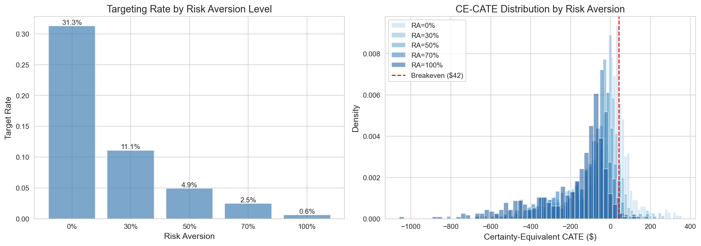

| Risk tolerance | λ parameter | Targeted segments | Expected profit | ROI |
|----------------|-------------|-------------------|-----------------|-----|
| **Aggressive** (λ=0) | Full CATE | Regular + H&B, Active Loyalists, Light Grocery, Fresh Lovers, Lapsed | +$2,426 | 125% |
| **Moderate** (λ=0.3) | 70% Point + 30% Lower | Regular + H&B, Active Loyalists, Light Grocery, Fresh Lovers | +$1,603 | 233% |
| **Conservative** (λ=0.7) | 30% Point + 70% Lower | Regular + H&B, Active Loyalists | ~$1,200 | ~200% |
| **Ultra-safe** (λ=1.0 / Lower CI > BE) | Lower bound only | Conservative (3 customers) | +$188 | 493% |

**Context-specific recommendations:**

| Business context | Recommended λ | Rationale |
|------------------|---------------|-----------|
| Before A/B test | 0.7–1.0 | Minimize downside risk |
| After validation | 0.3–0.5 | Balanced confidence |
| Budget-constrained | 0.0–0.3 | Maximize absolute profit |
| New market/product | 0.5–0.7 | Limited historical data |

---

#### A.6.4 Campaign-Type Alternatives (Future Analysis)

| Segment | TypeA response | Hypothetical TypeB | Hypothetical TypeC | Recommended test |
|---------|----------------|--------------------|--------------------|------------------|
| VIP Heavy | **Negative** | Neutral/positive? | Premium tier? | Test premium offers |
| Bulk Shoppers | **Negative** | Bulk deals? | Subscription? | Test bulk-specific offers |
| Fresh Lovers | Positive | Fresh specials? | Recipe app? | Keep TypeA + test B |
| Light Grocery | Positive | Habit triggers? | Gamification? | Keep TypeA + test C |

**Note:** TypeB/TypeC analysis requires a separate HTE study with a campaign-type-specific design.

---

## References

### Causal Inference Foundations
- Imbens, G. W., & Rubin, D. B. (2015). *Causal Inference for Statistics, Social, and Biomedical Sciences: An Introduction*. Cambridge University Press.
- Rosenbaum, P. R., & Rubin, D. B. (1983). The central role of the propensity score in observational studies for causal effects. *Biometrika*, 70(1), 41-55.

### Heterogeneous Treatment Effects
- Athey, S., & Imbens, G. (2016). Recursive partitioning for heterogeneous causal effects. *Proceedings of the National Academy of Sciences*, 113(27), 7353-7360.
- Wager, S., & Athey, S. (2018). Estimation and inference of heterogeneous treatment effects using random forests. *Journal of the American Statistical Association*, 113(523), 1228-1242.
- Kennedy, E. H. (2023). Towards optimal doubly robust estimation of heterogeneous causal effects. *Electronic Journal of Statistics*, 17(2), 3008-3049.

### Policy Learning
- Athey, S., & Wager, S. (2021). Policy learning with observational data. *Econometrica*, 89(1), 133-161.
- Zhou, Z., Athey, S., & Wager, S. (2023). Offline multi-action policy learning: Generalization and optimization. *Operations Research*, 71(1), 148-183.

### Positivity and Sensitivity Analysis
- Petersen, M. L., Porter, K. E., Gruber, S., Wang, Y., & van der Laan, M. J. (2012). Diagnosing and responding to violations in the positivity assumption. *Statistical Methods in Medical Research*, 21(1), 31-54.
- VanderWeele, T. J., & Ding, P. (2017). Sensitivity analysis in observational research: Introducing the E-value. *Annals of Internal Medicine*, 167(4), 268-274.

### Retail Marketing Applications
- Rossi, P. E., McCulloch, R. E., & Allenby, G. M. (1996). The value of purchase history data in target marketing. *Marketing Science*, 15(4), 321-340.
- Hitsch, G. J., & Misra, S. (2018). Heterogeneous treatment effects and optimal targeting policy evaluation. *SSRN Working Paper*.

### Software
- Battocchi, K., et al. (2019). EconML: A Python package for ML-based heterogeneous treatment effects estimation. Microsoft Research.
- Chen, T., & Guestrin, C. (2016). XGBoost: A scalable tree boosting system. *Proceedings of the 22nd ACM SIGKDD*, 785-794.
